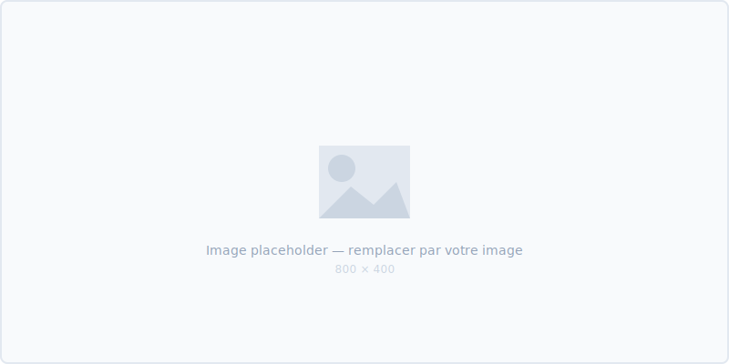

# Corps du Document

## Section Principale

Contenu de votre section principale. Utilisez des titres `##` pour les sections et `###` pour les sous-sections.

### Sous-section

Lorem ipsum — remplacez avec votre contenu réel.

---

## Exemple : Bloc de Code

```python
def exemple():
    """Exemple de bloc de code avec coloration syntaxique."""
    resultat = {
        "status": "success",
        "data": [1, 2, 3]
    }
    return resultat
```

---

## Exemple : Image



*Figure 1 — Légende de l'image*

---

## Exemple : Callouts

> **Info** — Utilisez ce bloc pour des informations importantes.

> **Attention** — Utilisez ce bloc pour des avertissements.

> **Tip** — Utilisez ce bloc pour des conseils pratiques.

---

## Exemple : Liste de Tâches

- [x] Tâche complétée
- [ ] Tâche en cours
- [ ] Tâche à faire

---

## Exemple : Citation

> *"Une citation importante ou une phrase clé qui mérite d'être mise en avant."*
>
> — Source ou auteur

---

## Analyse

### Points Forts

| Critère       | Évaluation | Commentaire          |
|---------------|:----------:|----------------------|
| Performance   | ★★★★☆     | Bonne performance    |
| Fiabilité     | ★★★★★     | Excellent            |
| Coût          | ★★★☆☆     | Amélioration possible|
| Maintenabilité| ★★★★☆     | Bien documenté       |
