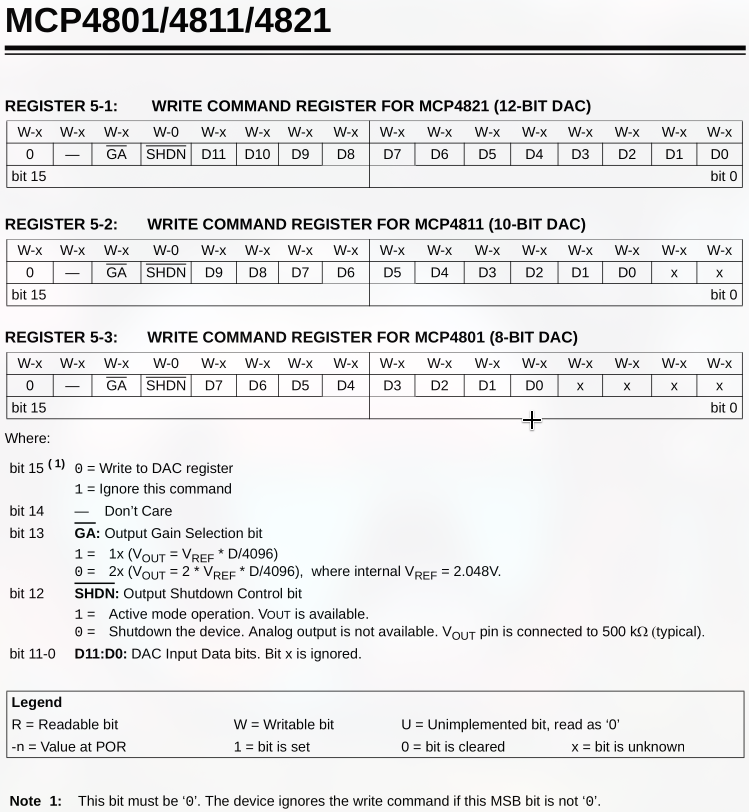

<div style='page-break-after: always;'></div>

# Document body

## How to create a project on MPLAB

## GPIO Project

In this section you will implement everything to setup a GPIO communication with input and output tools.

### Goals

In this project you will:

- Make a LED blink

- Turn the LED on while you hold a switch

- Use the switch to turn the LED on and off

The tools involved are LED1 and SW2.

### Physical setup


*Figure 1 — Pin mapping of the dsPIC33CK64MC105 on the Curiosity Nano Explorer board. The left side shows the microcontroller's physical pins; the right side shows how they are exposed on the Explorer board connectors. To follow this tutorial, place a jumper linking the **LED1** pin to **IO11**, and another linking **SW2** to **IO20**.*

Once the jumpers are in place, you can move on to the software setup.

### Setting up on MPLAB

#### 1. Make a LED blink

First, we want to control LED1, which you can find on the board here:


To drive this LED you need to configure pin **RC5** as a digital output. Open the MCC Melody interface by clicking the blue MCC icon, then apply the following configuration:


You can either click on the pin directly in the chip view (top-left corner) and select `GPIO_OUTPUT`, or use the pin table at the bottom of the screen and enable output on RC5. Either way, rename the pin to `LED1` to keep your code readable — select *Project Resources* on the left, then click **Generate**.

This modifies two files — `pins.h` and `pins.c` — by declaring and implementing a set of macros you will use in `main.c`.

Each macro maps the human-readable name `LED1` to one of three hardware registers that control pin RC5:

- `_LATC5` (**LAT**ch register) — the value the PIC *drives* on the output pin (0 or 1).

- `_TRISC5` (**TRIS**tate register) — pin direction: `0` = output, `1` = input.

- `_RC5` (**PORT** register) — the *actual* logic level present on the pin.


The generated macros in `pins.h` wrap these registers:

```c
// pins.h — macros for LED1 (mapped to pin RC5)

// drive pin HIGH
#define LED1_SetHigh()          (_LATC5 = 1)   

// drive pin LOW
#define LED1_SetLow()           (_LATC5 = 0)   

// invert current output level
#define LED1_Toggle()           (_LATC5 ^= 1)  

// read actual pin level
#define LED1_GetValue()         _RC5            

// set pin as input
#define LED1_SetDigitalInput()  (_TRISC5 = 1)  

// set pin as output
#define LED1_SetDigitalOutput() (_TRISC5 = 0)  

// applies the full pin configuration from MCC
void PINS_Initialize(void);  
```

Back in `main.c`, making the LED blink is straightforward:

```c
#include "mcc_generated_files/system/system.h"
#include "mcc_generated_files/system/pins.h"

// Fosc / 2 — required by libpic30 delay macros
#define FCY 100000000UL 
#include <libpic30.h>

int main(void)
{
    SYSTEM_Initialize();
    while(1)
    {
        // wait half a second
        __delay_ms(500); 

        // turn LED on  (active low)
        LED1_SetLow();   
        __delay_ms(500);

        // turn LED off
        LED1_SetHigh();  
    }
}
```

Now that you understand what each macro does, you can simplify this with `Toggle`:

```c
int main(void)
{
    SYSTEM_Initialize();
    while(1)
    {
        __delay_ms(500);
        LED1_Toggle();
    }
}
```

The LED should now blink every half second.

---

#### 2. Hold a switch to turn the LED on

Go back to the MCC Melody pin manager and add **RD1** as a digital input — this is where SW2 is connected (refer to the mapping diagram if needed). Name it `SW2`, tick *Weak Pullup*, then click **Generate**.


The weak pull-up keeps the pin at a logic HIGH when the button is not pressed. When you press the button, it connects the pin to ground, pulling it LOW. This is why the condition below checks for `== 0`.

```c
int main(void)
{
    SYSTEM_Initialize();
    while(1)
    {
        // button pressed → pin pulled LOW
        if(SW2_GetValue() == 0) { 
            // turn LED on
            LED1_SetLow();        
        }
        else {
            // turn LED off
            LED1_SetHigh();       
        }
    }
}
```

---

#### 3. Toggle the LED with a switch press

You now have all the building blocks. The idea is to combine the delay from step 1 with the button read from step 2: every loop iteration, wait a short time, then check the button and toggle if it is pressed.

```c
int main(void)
{
    SYSTEM_Initialize();
    while(1)
    {
        if(SW2_GetValue() == 0) {
            LED1_Toggle();
        }
    }
}
```

This works — but not reliably. The issue is a **timing mismatch** between the loop and the human finger.

The loop runs every 50 ms. A typical button press lasts 200–400 ms. During that window, the loop executes the `Toggle` call **4 to 8 times**, so the LED flickers unpredictably instead of cleanly switching state.

The diagram below illustrates this: a single press lasting ~240 ms is seen as four separate LOW readings by the loop, producing four unwanted toggles.


This is called a **debouncing problem**. It can be solved properly using:

* a **hardware timer** to sample the button at a fixed rate and require a stable state before acting, or

* **interrupts**, which let the MCU react the instant the pin changes rather than polling it in a loop.

Both approaches are covered in the next sections.

<div style='page-break-after: always;'></div>

# Timer Project

In this section you will use a hardware timer to generate precise, **non-blocking** timing. You will then use that same timer to fix the button-**debouncing** problem left open at the end of the GPIO project.

## Goals

In this project you will:

- Blink LED1 **without blocking** the CPU (no more `__delay_ms`)
- Configure a timer to raise an **interrupt** at a fixed rate, and run your code from a **callback**
- Use that fixed-rate sampling to **debounce** SW2 and toggle the LED cleanly — exactly one toggle per press

The tools involved are **LED1** and **SW2**, same as the GPIO project.

## Physical setup

No new wiring. Keep the same jumpers as in the GPIO project: **LED1 → IO11** and **SW2 → IO20**.

`[CAPTURE: board with the LED1 and SW2 jumpers in place]`

## Why a timer?

In the GPIO project you used `__delay_ms(500)`. That macro is a **busy wait**: the CPU spins in a loop doing nothing useful for the whole half-second, so it cannot react to anything else during that time.

A hardware timer is a counter that runs **in parallel** with your program. It increments on its own from the system clock and, when it reaches a value you choose (its *period*), it raises a flag — and optionally triggers an **interrupt**. The CPU stays free; it only stops briefly to run a short *callback* when the timer fires, then carries on.

On this board the instruction clock is `FCY = 100 MHz` (`FOSC / 2`). The timer counts at a rate derived from `FCY`, and MCC computes the right reload value for the period you ask for — you do not have to do the register math by hand.

## Setting up on MPLAB

### 1. Add and configure the timer

Open the MCC Melody interface (blue MCC icon). In **Device Resources**, add a **Timer (TMR1)**. In its configuration panel set:

- **Clock source**: `FOSC/2` (i.e. `FCY`)
- **Requested Period**: `500 ms` (to reproduce the GPIO blink) — you will lower this later for debouncing
- Tick **Enable Timer Interrupt**

Then select **Project Resources** on the left and click **Generate**.

`[CAPTURE: MCC Melody TMR1 configuration window]`

This generates `tmr1.h` and `tmr1.c`, which expose (among others):

- `TMR1_Initialize()` — applies the configuration (already called by `SYSTEM_Initialize()`)
- `TMR1_Start()` / `TMR1_Stop()` — run / halt the timer
- a **callback registration** function, typically `TMR1_TimeoutCallbackRegister(void (*handler)(void))`

> Check the exact name of the callback function in your generated `tmr1.h` — depending on the driver version it may differ slightly (e.g. `TMR1_TimeoutCallbackRegister` vs `TMR1_OverflowCallbackRegister`). Use the one that is actually declared.

### 2. Non-blocking blink

The idea: register a callback that toggles LED1, and let the timer call it on its own every period. The `while(1)` loop is now free.

```c
#include "mcc_generated_files/system/system.h"
#include "mcc_generated_files/system/pins.h"

// Called automatically every timer period (here: 500 ms), from the timer interrupt
static void Timer1_Tick(void)
{
    LED1_Toggle();
}

int main(void)
{
    SYSTEM_Initialize();

    TMR1_TimeoutCallbackRegister(&Timer1_Tick);   // check the exact name in tmr1.h
    TMR1_Start();

    while (1)
    {
        // The CPU is free here for other tasks — no blocking delay.
    }
}
```

The LED now blinks every 500 ms, but the main loop is completely available. Compare this with the GPIO version where `__delay_ms` froze everything: that difference is the whole point of using a timer.

`[CAPTURE: LED1 blinking]`

### 3. Debouncing SW2 with the timer

Recall the problem from the GPIO project: a single ~240 ms press was read thousands of times by the fast loop, producing several unwanted toggles. The fix is to **sample the button at a fixed, slow rate** and only act when the level has been **stable** for several samples — and only on the **transition** from released to pressed.

Change the timer **Requested Period** to **5 ms** and regenerate, then use a small state machine in the callback:

```c
#include "mcc_generated_files/system/system.h"
#include "mcc_generated_files/system/pins.h"
#include <stdbool.h>
#include <stdint.h>

#define STABLE_SAMPLES  4      // 4 x 5 ms = 20 ms of a stable level required

// Called every 5 ms
static void Timer1_Tick(void)
{
    static uint8_t counter     = 0;
    static bool    stableState = true;          // true = released (weak pull-up keeps it HIGH)

    bool reading = (SW2_GetValue() != 0);       // true = released, false = pressed (active low)

    if (reading != stableState)
    {
        counter++;
        if (counter >= STABLE_SAMPLES)          // the new level has held long enough
        {
            stableState = reading;
            counter      = 0;

            if (stableState == false)           // newly, stably PRESSED -> act once
            {
                LED1_Toggle();
            }
        }
    }
    else
    {
        counter = 0;                            // bounce/noise: reset the stability counter
    }
}

int main(void)
{
    SYSTEM_Initialize();

    TMR1_TimeoutCallbackRegister(&Timer1_Tick);
    TMR1_Start();

    while (1)
    {
        // free
    }
}
```

Now one physical press = exactly **one** toggle, no matter how the contact bounces or how long you hold the button. Try holding it down: the LED no longer flickers.

`[CAPTURE: clean single toggle per press]`

## What you learned

- A hardware timer gives **deterministic, parallel** timing without blocking the CPU.
- **Interrupts + callbacks** let the MCU react on a fixed schedule instead of polling in a tight loop.
- **Fixed-rate sampling with a stability count** is the standard, reliable way to debounce a mechanical input.

## Next
**PWM** — generating an analog-like level (LED brightness, servo angle) from a digital pin, using the dsPIC's PWM/SCCP modules.


<div style='page-break-after: always;'></div>

## ADC Project

In this section you will read the on-board rotary potentiometer with the dsPIC's analog-to-digital converter (ADC), and display the live value on the SSD1306 OLED screen over I2C.

### Goals

In this project you will:

- Configure the ADC to read an analog voltage from the **potentiometer**
- Convert that reading into a digital value (0–4095)
- Drive the **OLED display** over I2C and show the value, updated in real time

The tools involved are the **POT-METER** (rotary potentiometer), the **OLED display** (SSD1306), and **LED1** as a simple heartbeat.

### Physical setup


*Figure — Pin mapping of the dsPIC33CK64MC105 on the Curiosity Nano Explorer board. The potentiometer's wiper is exposed as **POT-METER** and maps to the **ADC7** position, which is physical pin **RA0 / AN0**. Place a jumper linking **POT-METER** to **ADC7**.*

The OLED is permanently wired to the board's I2C bus, but that bus only reaches the microcontroller through the two **I2C SDA** and **I2C SCL** jumpers in the COM remapping area. Make sure **both** are in place — if either is missing, the screen (and every other I2C device on the board) will never answer.

`[CAPTURE: close-up of the board showing (1) the POT-METER -> ADC7 jumper and (2) the two I2C SDA / I2C SCL jumpers in the COM remapping area, all in place]`

### What is an ADC?

The microcontroller is digital: it only understands 0s and 1s. The potentiometer, on the other hand, outputs a **continuous voltage** between 0 V and 3.3 V depending on its position. An **Analog-to-Digital Converter** bridges the two worlds: it samples that voltage and returns a number proportional to it.

This dsPIC's ADC is **12-bit**, so it splits the 0–3.3 V range into `2^12 = 4096` steps. A reading of `0` means ~0 V (potentiometer fully one way), `4095` means ~3.3 V (fully the other way), and `2048` is roughly the middle. Each step therefore represents about `3.3 V / 4096 ≈ 0.8 mV`.

### Setting up on MPLAB

#### 1. Configure the ADC pin and module

Open the MCC Melody interface (blue MCC icon).

First, in the **pin table**, set **RA0** as an **analog input** and tick its *analog* box, then rename it `POT`.

Next, in **Device Resources**, add the **ADC** module. In its configuration, find the channel table, enable the **AN0** channel, give it the custom name `POT`, and — this step is easy to miss — set its **Trigger Source** to **Common Software Trigger**. Without a trigger source, the software trigger fires but no channel is subscribed to it, so no conversion ever happens.


*Figure — ADC channel table: AN0 enabled, named POT, Trigger Source set to Common Software Trigger.*

Select **Project Resources** on the left and click **Generate**. This produces `adc1.h` / `adc1.c`, which expose (among others):

- `ADC1_Enable()` — powers up the ADC core
- `ADC1_SoftwareTriggerEnable()` — starts a conversion on the common software trigger
- `ADC1_ConversionResultGet(POT)` — returns the latest 12-bit result for the POT channel

#### 2. Read the potentiometer

A minimal read loop: trigger a conversion, give it a brief moment to complete, then read the result.

```c
#include "mcc_generated_files/system/system.h"
#include "mcc_generated_files/system/pins.h"
#include "mcc_generated_files/adc/adc1.h"

#define FCY 100000000UL
#include <libpic30.h>

uint16_t adcValue;

int main(void)
{
    SYSTEM_Initialize();
    ADC1_Enable();

    while (1)
    {
        ADC1_SoftwareTriggerEnable();      // start a conversion
        __delay_us(50);                    // let it finish
        adcValue = ADC1_ConversionResultGet(POT);   // 0 .. 4095
    }
}
```

> A cleaner alternative is to poll a "conversion complete" status instead of using a fixed delay (e.g. `while (!ADC1_IsConversionComplete(POT)) { }`). Check the exact function name and behaviour in your generated `adc1.h` before relying on it. The fixed `__delay_us` above is simpler and perfectly fine at this stage.

At this point `adcValue` holds a live reading, but you have no way to *see* it. That is what the OLED is for.

#### 3. Add the OLED display

The OLED uses the SSD1306 controller over I2C. Rather than write a driver from scratch, we reuse Microchip's example driver (`ssd1306.c`, `ssd1306.h`, `font.h`) and port it onto the dsPIC. **Copy the three files into the project folder** (next to `main.c`) and add them via *Add Existing Item…* — do not leave them outside the project, or the include paths break.

A few points matter when porting this driver:

- **One definition rule.** `font.h` ships with the `ASCII` and `MCHP` arrays *defined* in the header. A header is included by several `.c` files, so this causes a *multiple definition* link error. Move the array **definitions** into `ssd1306.c`, and leave only `extern` **declarations** in `font.h`:
  ```c
  extern const unsigned char ASCII[][5];
  extern const unsigned char MCHP[1024];
  ```

- **I2C address.** On this board the OLED answers at **`0x3D`** (the alternative `0x3C` only applies if pin A0 is tied to GND, which it is not here). Set:
  ```c
  #define SSD1306_I2C_ADDRESS 0x3D
  ```

- **Delays.** The driver uses `__delay_ms` / `__delay_us`, which require `FCY` to be defined **before** `#include <libpic30.h>`. Add `#define FCY 100000000UL` at the top.

- **Reset line.** The SSD1306 RESET pin is handled automatically by an on-board RC network, so there is **no** microcontroller pin to drive — you can ignore reset entirely in software.

Add the **I2C (I2C1, Host)** module in MCC, set it to **100 kHz**, generate, and make sure `ssd1306.c` includes the generated driver header:
```c
#include "mcc_generated_files/i2c_host/i2c1.h"
```

`[CAPTURE: MCC I2C1 configuration window — Host mode, 100 kHz, on RC8/RC9]`

#### 4. The non-blocking I2C trap

This is the subtle part, and the one most likely to leave you with a **blank screen even though everything compiles**.

The MCC `I2C1_Write()` function is **non-blocking and interrupt-driven**: it *starts* a transfer and returns immediately. Its `true`/`false` return only means "request accepted", not "transfer finished". The original driver simply waits a fixed `__delay_us(100)` after each write — but a 2-byte transfer at 100 kHz takes about **280 µs**, far more than 100 µs. So the next command is fired while the previous one is still on the bus, `I2C1_Write()` sees the bus busy, returns `false`, and **the byte is silently dropped**. Across the ~25 commands of `SSD1306_Init()`, almost all are lost, the display is never initialised, and it stays black — without ever blocking.

The fix is to wait for the **real** end of each transfer using `I2C1_IsBusy()` instead of a blind delay. In `ssd1306.c`:

```c
// Send an I2C command byte
void SSD1306_SendCommand(uint8_t command) {
    uint8_t cmd[] = {SSD1306_COMMAND, command};
    while (I2C1_IsBusy()) { }                        // bus free?
    I2C1_Write(SSD1306_I2C_ADDRESS, cmd, sizeof(cmd));
    while (I2C1_IsBusy()) { }                        // wait for completion
}

// Send an I2C data byte
void SSD1306_SendData(uint8_t data) {
    uint8_t d[] = {SSD1306_DATA_CONTINUE, data};
    while (I2C1_IsBusy()) { }
    I2C1_Write(SSD1306_I2C_ADDRESS, d, sizeof(d));
    while (I2C1_IsBusy()) { }
}
```

`I2C1_IsBusy()` waits exactly as long as the transfer needs — no more, no less — so no byte is ever dropped.

#### 5. Putting it together

```c
#include "mcc_generated_files/system/system.h"
#include "mcc_generated_files/system/pins.h"
#include "mcc_generated_files/adc/adc1.h"
#include "ssd1306.h"
#include <stdio.h>

#define FCY 100000000UL
#include <libpic30.h>

uint16_t adcValue;
char buffer[16];

int main(void)
{
    SYSTEM_Initialize();
    ADC1_Enable();
    SSD1306_Init();
    SSD1306_Clear();

    while (1)
    {
        ADC1_SoftwareTriggerEnable();
        __delay_us(50);
        adcValue = ADC1_ConversionResultGet(POT);

        // %4u + trailing spaces: pads the number and erases the previous digits
        sprintf(buffer, "POT: %4u   ", adcValue);
        SSD1306_SelectPage(0);
        SSD1306_WriteString(buffer);

        LED1_Toggle();          // heartbeat: confirms the loop is running
        __delay_ms(100);
    }
}
```

Turn the potentiometer: the number on the OLED should sweep between roughly `0` and `4095`, and LED1 should blink steadily.

`[CAPTURE: OLED showing "POT: nnnn", with the potentiometer at a mid position]`
`[CAPTURE: two photos side by side — potentiometer turned fully one way (~0) and fully the other (~4095) — to show the value tracking]`

### What you learned

- An **ADC** turns a continuous voltage into a discrete number; this 12-bit ADC gives 0–4095 over 0–3.3 V.
- A software-triggered ADC channel needs an explicit **Trigger Source** (Common Software Trigger), or it never converts.
- MCC's `I2C1_Write()` is **non-blocking** — you must wait on `I2C1_IsBusy()` between transfers, otherwise commands are dropped and the display stays blank.
- Reusing a third-party driver means respecting C basics: **definitions in a `.c`, `extern` declarations in the `.h`**, and the files physically inside the project.

### Next

**ADC + PWM** — reuse this ADC reading to drive a PWM duty cycle (for example LED brightness), closing the loop between an analog input and an analog-like output.


<div style='page-break-after: always;'></div>

## Proximity Sensor Project

In this section you will read the on-board **VCNL4200** infrared proximity sensor over I2C and show the live distance value on the OLED screen.

This is the **first stage of a larger application**: later sections will reuse this same reading to drive a colour LED (so the colour follows your hand) and to stream the value to a PC over the serial port. Here we focus on getting the sensor to talk.

### Goals

In this project you will:

- Configure and read a real external **I2C sensor** (the VCNL4200)
- Understand why a register read needs a **repeated start** (`I2C1_WriteRead`)
- Reuse the OLED to display the live **proximity** value

The tools involved are the **VCNL4200 proximity sensor**, the **OLED display**, and **LED1** as a heartbeat.

### Physical setup

The VCNL4200 and the OLED both sit on the **same I2C bus**, at different addresses (`0x51` for the sensor, `0x3D` for the screen), so there is nothing new to wire. As in the ADC project, only the two **I2C SDA** and **I2C SCL** jumpers in the COM remapping area need to be in place.

`[CAPTURE: board close-up showing the two I2C SDA / I2C SCL jumpers in place (same as the ADC project)]`

### How a proximity sensor works

The VCNL4200 has an infrared emitter and a light detector. It sends out IR pulses and measures how much light bounces back: the closer an object is, the more light is reflected, so the reported value **rises as something approaches** and falls back to a baseline when nothing is near. It is not an absolute distance in centimetres — it is a relative reflectance value (here 12-bit, 0–4095).

Communication is over I2C, but with one twist compared to the OLED: the sensor's registers are **16-bit words**, each addressed by a one-byte **command code**, and the data comes back **least-significant byte first**.

### Setting up on MPLAB

#### 1. Reuse the existing setup

No new MCC module is needed. You already have **I2C1 (Host, 100 kHz)** and the ported OLED driver from the ADC project — keep them. You do **not** need the ADC module here, since the sensor is digital (I2C), not analog.

#### 2. The VCNL4200 register map

We only need three registers, each identified by its command code:

| Command code | Register | Use |
|---|---|---|
| `0x03` | PS_CONF1 / PS_CONF2 | configuration (power on, integration time…) |
| `0x08` | PS_DATA | the proximity reading (16-bit, LSB first) |
| `0x0E` | ID | device ID — low byte is `0x58`, used to check the sensor is alive |

#### 3. Waking the sensor up

Out of reset, the proximity function is **shut down** (the `PS_SD` bit is set). To enable it, we write to the configuration register `0x03` with `PS_SD` cleared. We send three bytes: the command code, then the low byte (PS_CONF1), then the high byte (PS_CONF2).

```c
#define VCNL4200_ADDR     0x51
#define VCNL4200_PS_CONF  0x03   // command code: PS_CONF1 (low) + PS_CONF2 (high)
#define VCNL4200_PS_DATA  0x08   // command code: proximity output (16-bit, LSB first)
#define VCNL4200_ID       0x0E   // command code: device ID (low byte expected = 0x58)

static void VCNL4200_Init(void)
{
    // PS_CONF1 (low)  = 0x08 : proximity enabled (PS_SD = 0), medium integration time
    // PS_CONF2 (high) = 0x00 : 12-bit output, no interrupt (we poll)
    uint8_t cfg[3] = { VCNL4200_PS_CONF, 0x08, 0x00 };
    while (I2C1_IsBusy()) { }
    I2C1_Write(VCNL4200_ADDR, cfg, sizeof(cfg));
    while (I2C1_IsBusy()) { }
}
```

> The `0x08` configuration byte (integration time, duty) is a reasonable starting point. If your readings are too weak or too noisy, these are the tuning knobs to adjust — see the VCNL4200 datasheet.

#### 4. The repeated-start trap

This is the key new idea of this project. To read a register you cannot just "read 2 bytes" — you must first **tell the sensor which register** by sending its command code, and only then read the data. Crucially, between sending the command code and reading the result the bus must **not** be released: the read starts with a **repeated start**, not a fresh Start after a Stop. If you do a normal `I2C1_Write()` (which ends with a Stop) followed by a separate `I2C1_Read()`, the sensor loses track of the requested register and returns only zeros.

The MCC driver has exactly the right function for this: `I2C1_WriteRead()`, which writes the command code, inserts the repeated start, then reads — all in one transaction.

```c
// Read a 16-bit register via WriteRead (repeated start is mandatory)
static uint16_t VCNL4200_ReadReg(uint8_t reg)
{
    uint8_t rx[2] = {0, 0};
    while (I2C1_IsBusy()) { }
    I2C1_WriteRead(VCNL4200_ADDR, &reg, 1, rx, 2);
    while (I2C1_IsBusy()) { }
    return (uint16_t)(rx[0] | (rx[1] << 8));   // LSB first
}
```

#### 5. Validate before trusting the data

Before reading proximity, read the **ID register** (`0x0E`). It must return `0x58` in its low byte (`0x1058` as a full word). If you get that, the I2C link and the `WriteRead` are working; if not, fix the link first instead of chasing the proximity value. This is a cheap, reliable "is the device alive?" check — the same idea as pinging a device address.

#### 6. Putting it together

```c
#include "mcc_generated_files/system/system.h"
#include "mcc_generated_files/system/pins.h"
#include "mcc_generated_files/i2c_host/i2c1.h"
#include "ssd1306.h"
#include <stdio.h>

#define FCY 100000000UL
#include <libpic30.h>

#define VCNL4200_ADDR     0x51
#define VCNL4200_PS_CONF  0x03
#define VCNL4200_PS_DATA  0x08
#define VCNL4200_ID       0x0E

static void VCNL4200_Init(void)
{
    uint8_t cfg[3] = { VCNL4200_PS_CONF, 0x08, 0x00 };
    while (I2C1_IsBusy()) { }
    I2C1_Write(VCNL4200_ADDR, cfg, sizeof(cfg));
    while (I2C1_IsBusy()) { }
}

static uint16_t VCNL4200_ReadReg(uint8_t reg)
{
    uint8_t rx[2] = {0, 0};
    while (I2C1_IsBusy()) { }
    I2C1_WriteRead(VCNL4200_ADDR, &reg, 1, rx, 2);
    while (I2C1_IsBusy()) { }
    return (uint16_t)(rx[0] | (rx[1] << 8));
}

uint16_t prox;
char buffer[16];

int main(void)
{
    SYSTEM_Initialize();
    SSD1306_Init();
    SSD1306_Clear();
    VCNL4200_Init();

    // Sanity check: the ID must read 0x1058 (low byte 0x58)
    uint16_t id = VCNL4200_ReadReg(VCNL4200_ID);
    sprintf(buffer, "ID: %04X   ", id);
    SSD1306_SelectPage(0);
    SSD1306_WriteString(buffer);
    __delay_ms(2000);                 // hold the ID on screen for 2 s

    while (1)
    {
        prox = VCNL4200_ReadReg(VCNL4200_PS_DATA);
        sprintf(buffer, "PROX:%5u   ", prox);
        SSD1306_SelectPage(0);
        SSD1306_WriteString(buffer);

        LED1_Toggle();                // heartbeat
        __delay_ms(100);
    }
}
```

On power-up the screen briefly shows the device ID, then switches to the live proximity value: move your hand towards the sensor and the number climbs; pull away and it drops back.

`[CAPTURE: OLED showing "ID: 1058" at startup]`
`[CAPTURE: two photos side by side — hand far from the sensor (low value) and hand close (high value) — showing PROX tracking]`

### What you learned

- Driving an **external I2C sensor** means two steps: **configure** its registers, then **read** them.
- This sensor's registers are **16-bit, command-code addressed, LSB first**.
- A register read requires a **repeated start** — use `I2C1_WriteRead()`, never a separate Write then Read.
- Always **check the device ID first**: it isolates a wiring/protocol problem from a sensor-tuning problem.

### Next

This reading will now feed two outputs:

- **Colour LED (PWM)** — drive the on-board RGB LED with three PWM channels so its colour follows the proximity value. This is where PWM is finally used — and unlike a raw signal, you validate it directly with your eyes, no oscilloscope required.
- **Serial output (UART)** — send the proximity value to the PC over the debugger's virtual COM port (CDC), to read it in a terminal or plot it live in the Data Visualizer.

<div style='page-break-after: always;'></div>

## Serial Output Project (UART)

In this section you will send the live proximity value to a PC over the serial port, so you can read it in a terminal or plot it in real time with the MPLAB Data Visualizer.

This completes the sensor chain started in the previous section: the proximity value now goes to **three places** — the OLED, (later) the colour LED, and now the PC. The serial link also gives you something valuable for every project that follows: a **debug console**, a way to print values from the microcontroller straight to your computer.

### Goals

In this project you will:

- Configure a **UART** and understand that it reaches the PC through the on-board debugger's **virtual COM port** (CDC)
- Get the **TX/RX crossover** right — the most common UART mistake
- Send the proximity value to the PC, one reading per line

The tools involved are the **VCNL4200 sensor**, the **OLED**, and the **on-board debugger** (which bridges the UART to USB).

### Physical setup

There is **nothing to wire**. On the Curiosity Nano, one UART of the dsPIC is hard-wired to the on-board debugger, which forwards it to the PC as a virtual COM port over the **same USB cable** you already use to program the board. The two pins involved (RC10, RC11) are fixed by the board design, not something you jumper.

### How the serial link works

UART is a two-wire asynchronous link: one line to transmit (**TX**), one to receive (**RX**). The key rule is that the two devices are **crossed**: one device's TX must reach the other device's RX. So the microcontroller's **TX** connects to the debugger's **RX**, and vice versa.

This is where the board's labels can trick you. On the pin mapping, the CDC lines are named from the **PC's point of view**:

- **CDC RX** (pin RC10) is what the *PC receives* → this must be the **dsPIC's TX** (`U1TX`).
- **CDC TX** (pin RC11) is what the *PC sends* → this must be the **dsPIC's RX** (`U1RX`).

Get this backwards and nothing appears on the PC, even though everything compiles and runs.

### Setting up on MPLAB

#### 1. Add and configure the UART

Open MCC Melody and add the **UART1** module:

- **Baud rate**: `115200`
- **Data format**: `8N1` (8 data bits, no parity, 1 stop bit) — the defaults

In the **Pin Manager (Grid View)**, assign:

- `U1TX` → **RC10**
- `U1RX` → **RC11**

Then **Generate**.


*Figure — UART1 outputs assigned in the Pin Grid View: U1TX on RC10, U1RX on RC11.*

This generates `uart1.h` / `uart1.c`, exposing among others:

- `UART1_Write(uint8_t data)` — send one byte
- `UART1_IsTxReady()` — true when the transmit buffer can accept a byte
- `UART1_Read()` / `UART1_IsRxReady()` — for the receive side (not used here)

#### 2. `printf` vs `UART1_Write`

MCC offers an option, **"Redirect STDIO to UART"**. If you enable it, `printf()` sends its output straight to the UART and you can write `printf("%u\r\n", value)`. If it is **not** enabled — which is the default — `printf` compiles but sends its output nowhere, and the screen on the PC stays empty. That silent failure is easy to mistake for a wiring problem.

Since STDIO redirection is not enabled here, we send bytes explicitly with `UART1_Write`, wrapped in a small helper that waits for the transmitter to be free:

```c
// Send a string over the UART, byte by byte
static void UART_Print(const char *s)
{
    while (*s)
    {
        while (!UART1_IsTxReady()) { }   // wait until the TX buffer is free
        UART1_Write(*s++);
    }
}
```

#### 3. Putting it together

We reuse the proximity read and OLED display from the previous section, and add one serial print per loop. The `\r\n` (carriage return + newline) at the end puts each value on its own line — required for the Data Visualizer to plot them and for terminals to display them cleanly.

```c
#include "mcc_generated_files/system/system.h"
#include "mcc_generated_files/system/pins.h"
#include "mcc_generated_files/i2c_host/i2c1.h"
#include "mcc_generated_files/uart/uart1.h"
#include "ssd1306.h"
#include <stdio.h>
#define FCY 100000000UL
#include <libpic30.h>

#define VCNL4200_ADDR     0x51
#define VCNL4200_PS_DATA  0x08
#define VCNL4200_PS_CONF  0x03

static void VCNL4200_Init(void)
{
    uint8_t cfg[3] = { VCNL4200_PS_CONF, 0x08, 0x00 };
    while (I2C1_IsBusy()) { }
    I2C1_Write(VCNL4200_ADDR, cfg, sizeof(cfg));
    while (I2C1_IsBusy()) { }
}

static uint16_t VCNL4200_ReadReg(uint8_t reg)
{
    uint8_t rx[2] = {0, 0};
    while (I2C1_IsBusy()) { }
    I2C1_WriteRead(VCNL4200_ADDR, &reg, 1, rx, 2);
    while (I2C1_IsBusy()) { }
    return (uint16_t)(rx[0] | (rx[1] << 8));
}

static void UART_Print(const char *s)
{
    while (*s)
    {
        while (!UART1_IsTxReady()) { }
        UART1_Write(*s++);
    }
}

uint16_t prox;
char buffer[16];

int main(void)
{
    SYSTEM_Initialize();
    SSD1306_Init();
    SSD1306_Clear();
    VCNL4200_Init();

    while (1)
    {
        prox = VCNL4200_ReadReg(VCNL4200_PS_DATA);

        sprintf(buffer, "PROX:%5u   ", prox);
        SSD1306_SelectPage(0);
        SSD1306_WriteString(buffer);

        sprintf(buffer, "%u\r\n", prox);   // one value per line
        UART_Print(buffer);

        __delay_ms(100);
    }
}
```

#### 4. Reading it on the PC

Build and program the board, then open the virtual COM port at **115200 baud**.

On **Linux**, find the port and read it:

```bash
ls /dev/ttyACM*            # usually /dev/ttyACM0
screen /dev/ttyACM0 115200 # quit with Ctrl+A then K then y
```

If `screen` is not installed, `minicom -D /dev/ttyACM0 -b 115200` works too, or simply `stty -F /dev/ttyACM0 115200 && cat /dev/ttyACM0` just to watch the stream. If you get a *permission denied*, add yourself to the `dialout` group (`sudo usermod -aG dialout $USER`, then log out and back in).

You should see the proximity values scroll by, rising when you move your hand toward the sensor. In the **MPLAB Data Visualizer**, select the same COM port and baud rate to plot the values as a live curve — the software oscilloscope you were missing.

`[CAPTURE: terminal (or Data Visualizer plot) showing the proximity values streaming and reacting to a hand]`

### What you learned

- A UART is **crossed**: the microcontroller's TX goes to the receiver's RX. On this board, board labels are named from the PC's side (CDC RX = the dsPIC's TX).
- The Curiosity Nano bridges the UART to a **virtual COM port** over the debugger's USB — no extra cable or adapter.
- Ending each message with `\r\n` is what makes terminals and the Data Visualizer treat values as separate lines.
- Without **"Redirect STDIO to UART"**, `printf` sends nothing — send bytes with `UART1_Write` instead.

### Next

**SPI** — a faster, synchronous link, used on this board to reach the DAC (MCP4821) that drives the speaker, and later the addressable RGB ring.

> *Deferred refinement:* driving the on-board colour LED from the proximity value (three PWM channels) is left as a later addition — the LED is wired to pins the high-resolution PWM module cannot reach directly, so it needs either a different PWM peripheral routing or a software (bit-banged) PWM.


## Let's play some music !

Our Curiosity nano explorer has a speaker, if you look at the documentation you'll see that it is a **MCP4821** and on its own datasheet if you go to the section 5.0 about *Serial Interface* you can see bits and registers you'll modify to give the right infomation to the speaker.




On peut relever que : 

DAC CS => 
DAC LDAC
SP

 Sur ton mapping, localise les lignes : 
 SPI MOSI => RC0
 SPI SCK => RC2
 DAC CS (IO 26), DAC LDAC (IO 36), SPEAKER ENABLE (IO 12).

---

<div style='page-break-after: always;'></div>

## Sound Generation Project (SPI + DAC) — interactive

In this project you make the board **play sound**. The on-board speaker is not driven directly by the microcontroller: it is fed by an **MCP4821 DAC** connected over **SPI**. So generating sound means learning SPI and driving a DAC — two objectives in one.

The project is built in stages: first get a signal out of the DAC, then make it audible, then shape real waveforms. This section covers the first two.

> **How to use this section.** Each step starts with a **task** — what to achieve, and where to look. Try it yourself first. The exact answer is hidden under *"Show solution"* — open it only to check yourself or if you are stuck.

### Goals

- Configure the **SPI** peripheral as a host (master)
- Understand and build the **MCP4821 command frame**
- Output a voltage from the DAC and verify it on an oscilloscope
- Produce an audible tone through the speaker

The tools involved are the **MCP4821 DAC**, the **speaker circuit**, and an **oscilloscope** to observe the signal.

---

### Step 1 — Understand the DAC command frame

**Task.** Open the MCP4821 datasheet and find the *Write Command Register* figure. The DAC receives a **16-bit word** over SPI. Work out the bits you must send to output a value on **channel A**, with **gain ×1** and the **output active**. What is the final 16-bit word for a 12-bit sample `value`?

<details>
<summary>Show solution</summary>

The 16-bit word is **4 configuration bits** followed by **12 data bits**:

| Bit | Name | Value | Meaning |
|----|------|-------|---------|
| 15 | A/B  | 0 | channel A (the only one on the MCP4821) |
| 14 | —    | 0 | don't care |
| 13 | GA   | 1 | gain ×1 → output range 0–2.048 V |
| 12 | SHDN | 1 | output active (not shut down) |
| 11–0 | data | value | the 12-bit sample (0–4095) |

So the config nibble is `0b0011 = 0x3`, and:

```
word = 0x3000 | (value & 0x0FFF);
```

You send it **most-significant byte first**: high byte, then low byte, with **CS low** during the transfer and **CS high** afterwards to latch the output.
</details>

---

### Step 2 — Identify the pins

**Task.** Using the *Curiosity Nano Explorer* pin mapping, find which dsPIC pin carries each of these signals: **SPI MOSI**, **SPI SCK**, **DAC CS**, **SPEAKER ENABLE**. Also check the **DAC LDAC** line — what do you notice about it?

<details>
<summary>Show solution</summary>

| Signal | dsPIC pin | Role |
|--------|-----------|------|
| SDO1 (MOSI) | **RC0** | data µC → DAC (the DAC's SDI input) |
| SCK1 | **RC2** | SPI clock |
| DAC CS | **RB14** | chip select (driven as GPIO) |
| SPEAKER ENABLE | **RC6** | enables the audio amplifier (GPIO) |
| DAC LDAC | *not connected* | no µC pin — tied low on the board |

**LDAC is not routed to the microcontroller** (it lands on a NC pin, like the OLED reset earlier). It is tied low on the board, which means the DAC output updates on the rising edge of CS. You have nothing to control there.

Note the naming trap: the DAC's input is called **SDI**, but from the microcontroller's side it is an **output** (SDO/MOSI). The µC talks (SDO) → the DAC listens (SDI).
</details>

---

### Step 3 — Configure SPI and the GPIOs in MCC

**Task.** In MCC Melody, add and configure the SPI peripheral as a host, and add the two GPIO outputs you need. What settings and pin assignments do you use?

<details>
<summary>Show solution</summary>

**SPI1 module:**
- Mode: **Host / Master**
- Communication width: **8 bit**
- Clock: **~2 MHz** (the DAC accepts up to 20 MHz)
- SPI mode **0,0**: clock polarity *Idle Low*, data sampled in the *Middle*

**Pin assignments (Grid View):**
- `SDO1` → **RC0**
- `SCK1` → **RC2**
- leave `SDI1` and `SS1` unassigned (the DAC sends nothing back, and CS is handled by us)

**GPIO outputs (Pins), with custom names so the macros are readable:**
- `DAC_CS` → **RB14**, output
- `SPKR_EN` → **RC6**, output

Then **Generate**. Giving custom names produces `DAC_CS_SetLow()` etc.; without them MCC names the macros after the pin (`IO_RB14_SetLow()`).
</details>

---

### Step 4 — Physical setup (the part that bites)

**Task.** On this board, signals reach peripherals through **jumpers**. List everything that must be physically connected for the SPI to reach the DAC and for the DAC to reach the speaker — including anything outside the remapping area.

<details>
<summary>Show solution</summary>

In the **COM / remapping** area:
- **SPI MOSI** jumper (RC0 → the bus)
- **SPI SCK** jumper (RC2 → the bus)

In the **IO** areas:
- **DAC CS** jumper (IO 26 → RB14)
- **SPEAKER ENABLE** jumper (IO 12 → RC6)

In the **Speaker Circuit** area:
- the **DAC OUT ↔ SPEAKER IN** jumper (routes the DAC output into the amplifier)
- the speaker **ON/OFF switch** must be on **ON**, and the **GAIN** switch set (LOW or HIGH)

If any of these is missing, you get *no signal and no sound* — the most common cause of a silent board, and it costs nothing to check.
</details>

---

### Step 5 — Write the DAC output function

**Task.** Write a function `DAC_Write(uint16_t value)` that sends one sample to the DAC over SPI, using the frame from Step 1 and the API `SPI1_Exchange8bit(uint8_t)`.

<details>
<summary>Show solution</summary>

```c
static void DAC_Write(uint16_t value)
{
    uint16_t word = 0x3000u | (value & 0x0FFFu);   // DAC A, gain x1, active
    DAC_CS_SetLow();
    SPI1_Exchange8bit((uint8_t)(word >> 8));        // high byte (config + top 4 data bits)
    SPI1_Exchange8bit((uint8_t)(word & 0xFF));      // low byte (8 data bits)
    DAC_CS_SetHigh();                               // rising edge = output updates
}
```
</details>

---

### Step 6 — Make a tone

**Task.** Using `DAC_Write`, produce an audible **square wave** at roughly 440 Hz by alternating between two levels. Remember to enable the amplifier first. What does `main` look like?

<details>
<summary>Show solution</summary>

```c
int main(void)
{
    SYSTEM_Initialize();
    SPKR_EN_SetHigh();       // enable the amplifier

    while (1)
    {
        DAC_Write(3500);     // high level  (~1.75 V)
        __delay_us(1136);    // half period → ~440 Hz
        DAC_Write(600);      // low level   (~0.30 V)
        __delay_us(1136);
    }
}
```

The output voltage in gain ×1 is `V = (code / 4095) × 2.048 V`, so this swings between ~0.30 V and ~1.75 V — about **1.45 V peak-to-peak** at the DAC output.
</details>

---

### Step 7 — Nothing works? Debug it yourself

Work through these in order. Each symptom hides the thing to check.

<details>
<summary>No sound at all, and no signal on the oscilloscope</summary>

Almost always a **missing jumper** (Step 4) or the **speaker switch on OFF**. Check the four bus jumpers, the DAC OUT ↔ SPEAKER IN jumper, and the ON/OFF switch. Load a slow 1 Hz version (`DAC_Write(4095)` / `DAC_Write(0)` with `__delay_ms(500)`) and listen for a *tick… tick…*: each voltage step clicks in the speaker, which confirms the DAC and speaker path without needing the oscilloscope.
</details>

<details>
<summary>The oscilloscope shows a still dot or garbage, not a square wave</summary>

An analog oscilloscope needs a **fast, repetitive** signal and the right settings. Use the 440 Hz code, set **TIME/DIV ≈ 0.5 ms**, **VOLTS/DIV ≈ 0.5 V**, **COUPLING = DC** (not AC — AC removes the DC level and mangles the trace), and turn **TRIGGER LEVEL** until the image freezes. Make sure the channel's **GND** button is not pressed.
</details>

<details>
<summary>A signal is visible on the scope, but no sound</summary>

The DAC and SPI are fine — the problem is only the audio path. Check the **SPEAKER ENABLE** jumper, try `SPKR_EN_SetLow()` instead of `SetHigh()` (the enable polarity), the **ON/OFF switch**, and the **DAC OUT ↔ SPEAKER IN** jumper.
</details>

<details>
<summary>The output is flat at 0 V (DAC not responding)</summary>

The DAC is not receiving valid SPI. Check the **SPI mode**: the MCP4821 needs mode 0,0. If MCC left it on another mode, flip the **Clock Edge** setting, regenerate, and retest. Also confirm `SPI1_Initialize()` is called in `system.c`.
</details>

<div style='page-break-after: always;'></div>

## Sound Generation — Stage 2: Real Waveforms with a Timer

The first stage made a tone by alternating two levels with `__delay_us`. That works, but the timing is approximate and the CPU can do nothing else. To generate **clean, tunable waveforms**, the samples must be produced at a **fixed, precise rate** — the job of a **Timer interrupt**.

In this stage you feed the DAC from a **wave table** at a constant sample rate, and you get square, triangle and sine waves whose frequency you can set exactly.

### Goals

- Drive the DAC at a **fixed sample rate** using a Timer interrupt
- Understand the **phase accumulator** — how a fixed sample rate produces any frequency
- Store and play different **wave tables** (square, triangle, sine)

---

### Step 1 — Why a Timer instead of `__delay`?

**Task.** With the `__delay_us` loop, what two problems appear when you want a precise frequency *and* want the program to do other things (read a potentiometer, update the screen)? What rate should the samples come out at?

<details>
<summary>Show solution</summary>

Two problems: the delay is **approximate** (any code you add between writes changes the period, so the pitch drifts), and the CPU is **stuck** in the delay loop, unable to do anything else.

The fix is a **fixed sample rate**: output one sample every tick of a Timer interrupt. A rate of **~20 kHz** (one sample every 50 µs) is a good target — well above the audio band, so it reproduces tones cleanly. The main loop is then free for other work.
</details>

---

### Step 2 — Configure the Timer in MCC

**Task.** Add a Timer that fires at your sample rate (e.g. 20 kHz) and enable its interrupt. What do you configure?

<details>
<summary>Show solution</summary>

- Add a **Timer** (e.g. **TMR1**) in MCC.
- Set its **period to the sample rate**: 20 kHz → a period of **50 µs**.
- **Enable the timer interrupt** (tick the interrupt option), so a callback runs on every period.
- Generate. MCC produces an init and a way to register a callback — the exact name depends on the version (often `TMR1_TimeoutCallbackRegister(...)` or a `TMR1_SetInterruptHandler(...)`). Check the generated `tmr1.h` for the precise function.
</details>

---

### Step 3 — The phase accumulator

**Task.** You have a fixed sample rate `Fs` and a wave table of `N` samples. You want to play a note of frequency `f`. How do you decide, on each timer tick, which table entry to output? (Hint: think about how far through one cycle you advance per sample.)

<details>
<summary>Show solution</summary>

Per sample you advance by a **fraction `f / Fs` of a full cycle**. The clean way to track this is a **phase accumulator**: a 32-bit counter where the whole 0…2³² range represents one full cycle.

- **Phase increment** per sample: `phaseInc = f × 2³² / Fs`
- On each tick: `phase += phaseInc;`
- The top bits of `phase` index the table. For an `N = 256` table, the index is `phase >> 24` (top 8 bits).

The accumulator wraps around naturally at the end of a cycle, and changing `f` just changes `phaseInc` — so you retune instantly without touching the table.
</details>

---

### Step 4 — Build the wave tables

**Task.** Create a 256-entry, 12-bit wave table (values 0–4095, centred on 2048) for a **square**, a **triangle**, and a **sine**. How do you fill each?

<details>
<summary>Show solution</summary>

```c
#include <math.h>
#define TABLE_SIZE 256

uint16_t sine[TABLE_SIZE];
uint16_t triangle[TABLE_SIZE];
uint16_t square[TABLE_SIZE];

static void BuildTables(void)
{
    for (int i = 0; i < TABLE_SIZE; i++)
    {
        // sine: centred on 2048, amplitude 2047
        sine[i] = (uint16_t)(2048 + 2047.0 * sin(2.0 * M_PI * i / TABLE_SIZE));

        // triangle: up then down
        triangle[i] = (i < TABLE_SIZE/2)
                        ? (uint16_t)(i * 4095 / (TABLE_SIZE/2))
                        : (uint16_t)((TABLE_SIZE - i) * 4095 / (TABLE_SIZE/2));

        // square: first half high, second half low
        square[i] = (i < TABLE_SIZE/2) ? 4000 : 100;
    }
}
```

The sine uses `sin()` once at startup, so the cost is paid only at boot, not in the interrupt.
</details>

---

### Step 5 — Output samples in the interrupt

**Task.** In the timer callback, advance the phase and send the current table sample to the DAC. Write the callback and the pieces it needs.

<details>
<summary>Show solution</summary>

```c
#define FS  20000UL            // sample rate (Hz), matches the timer

volatile uint32_t phase = 0;
volatile uint32_t phaseInc = 0;
volatile uint16_t *waveform = square;   // current table

static void SetFrequency(uint32_t f)
{
    phaseInc = (uint32_t)(((uint64_t)f << 32) / FS);
}

// called on every timer tick (register this with MCC's timer callback)
void SampleTick(void)
{
    phase += phaseInc;
    DAC_Write(waveform[phase >> 24]);   // top 8 bits -> 0..255
}

int main(void)
{
    SYSTEM_Initialize();
    SPKR_EN_SetHigh();
    BuildTables();
    SetFrequency(440);                  // A4

    TMR1_TimeoutCallbackRegister(SampleTick);  // name may differ — check tmr1.h

    while (1)
    {
        // free for other work: read a pot, update the OLED, change waveform...
    }
}
```

Keep the callback short — it runs 20 000 times per second, so it must only advance the phase and write one sample.
</details>

---

### Step 6 — Choose the waveform, hear the difference

**Task.** Switch between square, triangle and sine at run time and listen. What changes, and how do you switch?

<details>
<summary>Show solution</summary>

Point `waveform` at a different table:

```c
waveform = sine;       // smooth, mellow
waveform = triangle;   // softer than square, richer than sine
waveform = square;     // harsh, buzzy (lots of harmonics)
```

Same pitch, different **timbre**: the square wave is bright and buzzy (many harmonics), the sine is pure and mellow, the triangle sits in between. On the oscilloscope you will see the actual shape of each — a great figure for the report.
</details>

---

### Step 7 — Not sounding right? Debug it

<details>
<summary>Sound is very faint</summary>

Check the **GAIN switch** in the Speaker Circuit (LOW/HIGH) — set it to HIGH. Also make sure your table uses a wide amplitude (near 0–4095), and consider the DAC gain bit ×2 for a larger output swing.
</details>

<details>
<summary>Pitch is wrong or drifts</summary>

The **timer period must exactly match `FS`** in your code — if the timer runs at a different rate than the `FS` you use in `SetFrequency`, every note is off. Recompute the timer period and confirm it against `FS`.
</details>

<details>
<summary>Sound is distorted / crackly</summary>

The interrupt may be **too slow or overloaded**. Make sure the callback only advances the phase and writes one sample — no `sin()`, no `sprintf`, no long work inside it. Building the tables must happen once in `main`, not in the interrupt.
</details>

---

### Next

With clean, tunable tones you can now add **control and display**:

- **A potentiometer** (reuse the ADC brick) mapped to **frequency** — turn the knob, change the pitch — or to **volume** by scaling the samples.
- **The OLED** showing the current waveform shape, frequency, or note name.
- Later: a **joystick** for two-axis control, or the **microphone** as an input, and eventually the **WS2812B ring** reacting to the sound for the integrated final project.