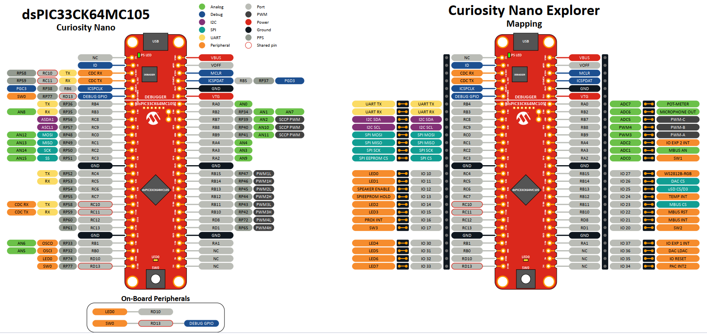
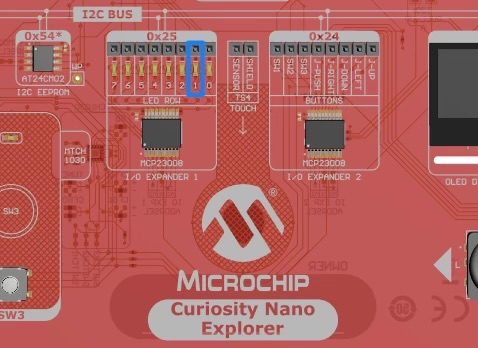
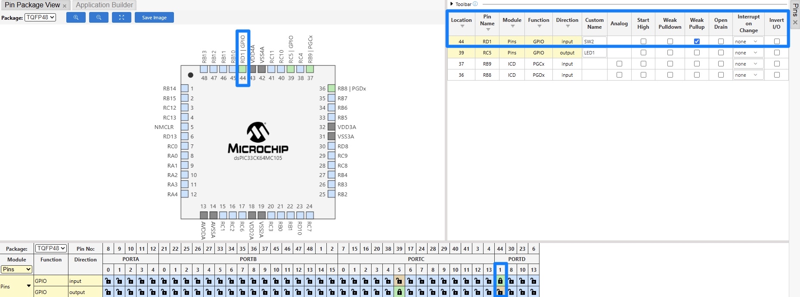

# GPIO Project — Digital Inputs & Outputs

In this lab you will implement everything needed to control a digital output (an LED) and read a digital input (a switch) on the dsPIC33CK64MC105.

## Goals

In this lab you will:

- Make a LED blink
- Turn the LED on while you hold a switch
- Use the switch to toggle the LED on and off

The tools involved are **LED1** and **SW2**.

## Physical setup


*Figure — Pin mapping of the dsPIC33CK64MC105 on the Curiosity Nano Explorer board. The left side shows the microcontroller's physical pins; the right side shows how they are exposed on the Explorer board connectors. Place a jumper linking **LED1** to **IO11**, and another linking **SW2** to **IO20**.*

Once the jumpers are in place, you can move on to the software part.

## Background — how a GPIO pin works

Each pin of the dsPIC is controlled by three hardware registers. For pin **RC5**:

- `_LATC5` (**LAT**ch) — the value the PIC *drives* on the pin when it is an output (0 or 1).
- `_TRISC5` (**TRIS**tate) — pin direction: `0` = output, `1` = input.
- `_RC5` (**PORT**) — the *actual* logic level present on the pin.
![DIAGRAM: "gpio-registers" — Block diagram of one GPIO pin. Left: a "CPU" box. From the CPU, an arrow goes into a box "LAT (value to drive)" which feeds a small triangle (output driver) connected to the pin (a square labelled RC5 at the far right). A box "TRIS (direction)" sits above the driver with a dashed arrow acting as an enable/switch on the driver (annotate: 0 = output enabled, 1 = high-impedance / input). A box "PORT (real pin level)" reads directly from the pin wire and returns an arrow back to the CPU. Three colours, one per register. Caption: "Write LAT, configure TRIS, read PORT."](../assets/images/01_GPIO/gpio-registers.png)

## Part 1 — Your mission

Work through the steps in order. For each step, write the code, flash it, and observe the board. The full correction (MCC screenshots and code) is at the end of the document — use it only to check yourself or if you are stuck.

### Step 1 — Make a LED blink

**Task.** LED1 is wired to pin **RC5**.

1. In MCC Melody, configure RC5 as a digital output and give it the custom name `LED1`, then generate the code.
2. Open the generated `pins.h` and identify the macros MCC created for `LED1`. Relate each macro to one of the three registers described in the Background.
3. In `main.c`, make the LED blink with a period of one second (500 ms on, 500 ms off).

*Hints:* the delay macros `__delay_ms()` come from `<libpic30.h>` and require `FCY` to be defined **before** the include. `FCY` is the instruction clock: `FOSC / 2 = 100 MHz` on this board. Also note that LED1 is **active low**.

### Step 2 — Hold a switch to turn the LED on

**Task.** SW2 is wired to pin **RD1**.

1. Add RD1 as a digital input named `SW2` in MCC. One extra option must be ticked so the pin has a defined level when the button is *not* pressed — find it.
2. Write a loop that keeps the LED on while the button is held, and off otherwise.
3. Before coding, answer: when the button is **not pressed**, what logic level does the pin read, and why? What does pressing the button do electrically?

### Step 3 — Toggle the LED with a switch press

**Task.** Combine the two previous steps: one press of SW2 should cleanly invert the LED state (press → on, press again → off).

1. Write the naive version first: in the loop, if the button reads pressed, toggle the LED.
2. Test it. Describe precisely what you observe when you press the button once. Is the behaviour reliable?
3. Explain *why* it behaves this way. Two timescales are involved: how long does one loop iteration take, and how long does a human press last?

Do not try to fully fix it yet — this problem (called **debouncing**) is the subject of the next lab. Just identify and explain it.

<div style='page-break-after: always;'></div>

## Part 2 — Guided correction

### Step 1 — Make a LED blink

Open the MCC Melody interface by clicking the blue MCC icon. You can either click on the pin directly in the chip view (top-left corner) and select `GPIO_OUTPUT`, or use the pin table at the bottom of the screen and enable output on RC5. Either way, rename the pin to `LED1` to keep your code readable — then select *Project Resources* on the left and click **Generate**.


*Figure — MCC pin configuration: RC5 as GPIO_OUTPUT, custom name LED1.*

LED1 itself is located here on the board:



Generation modifies two files — `pins.h` and `pins.c` — declaring macros that map the human-readable name `LED1` to the RC5 registers:

```c
// pins.h — macros for LED1 (mapped to pin RC5)
#define LED1_SetHigh()          (_LATC5 = 1)   // drive pin HIGH
#define LED1_SetLow()           (_LATC5 = 0)   // drive pin LOW
#define LED1_Toggle()           (_LATC5 ^= 1)  // invert current output level
#define LED1_GetValue()         _RC5           // read actual pin level
#define LED1_SetDigitalInput()  (_TRISC5 = 1)  // set pin as input
#define LED1_SetDigitalOutput() (_TRISC5 = 0)  // set pin as output

void PINS_Initialize(void);  // applies the full pin configuration from MCC
```

Note the mapping: `Set*/Toggle` write **LAT**, `GetValue` reads **PORT**, `SetDigital*` writes **TRIS**.

The blink itself:

```c
#include "mcc_generated_files/system/system.h"
#include "mcc_generated_files/system/pins.h"

// Fosc / 2 — required by libpic30 delay macros
#define FCY 100000000UL
#include <libpic30.h>

int main(void)
{
    SYSTEM_Initialize();
    while(1)
    {
        __delay_ms(500);
        LED1_SetLow();    // LED on (active low)
        __delay_ms(500);
        LED1_SetHigh();   // LED off
    }
}
```

Or, more simply, with the toggle macro:

```c
int main(void)
{
    SYSTEM_Initialize();
    while(1)
    {
        __delay_ms(500);
        LED1_Toggle();
    }
}
```

The LED blinks every half second.

### Step 2 — Hold a switch to turn the LED on

In the MCC pin manager, add **RD1** as a digital input, name it `SW2`, and tick ***Weak Pullup*** — that is the extra option. Then **Generate**.


*Figure — MCC pin configuration: RD1 as input, custom name SW2, Weak Pullup enabled.*

The weak pull-up keeps the pin at logic **HIGH** when the button is not pressed. Pressing the button connects the pin to ground, pulling it **LOW** — which is why the code checks for `== 0`:

```c
int main(void)
{
    SYSTEM_Initialize();
    while(1)
    {
        if(SW2_GetValue() == 0) {   // button pressed → pin pulled LOW
            LED1_SetLow();          // LED on
        }
        else {
            LED1_SetHigh();         // LED off
        }
    }
}
```

### Step 3 — Toggle the LED with a switch press

The naive version:

```c
int main(void)
{
    SYSTEM_Initialize();
    while(1)
    {
        if(SW2_GetValue() == 0) {
            LED1_Toggle();
        }
    }
}
```

This works — but not reliably: the LED ends up in a random state after each press. The issue is a **timing mismatch** between the loop and the human finger.

One loop iteration takes microseconds; a typical button press lasts 200–400 ms. During that window the loop executes `Toggle` thousands of times, so the LED flickers and lands on an unpredictable state.

The diagram below illustrates the principle: a single press lasting ~240 ms is seen as several separate LOW readings by the loop, producing several unwanted toggles.



This is the **debouncing problem**. It can be solved properly using:

- a **hardware timer** to sample the button at a fixed rate and require a stable state before acting, or
- **interrupts**, which let the MCU react the instant the pin changes rather than polling it in a loop.

The timer approach is the subject of the next lab.

## What you learned

- A GPIO pin is controlled through three registers: **LAT** (value driven), **TRIS** (direction), **PORT** (real level).
- MCC's custom pin names generate readable macros (`LED1_Toggle()`, `SW2_GetValue()`).
- A **weak pull-up** gives an input a defined idle level; a pressed button pulls the line low (active-low logic).
- Polling a mechanical button in a fast loop is unreliable: contact **bounce** and the loop/press timescale mismatch cause multiple unwanted triggers.

## Next

**Timer** — precise, non-blocking timing with a hardware timer and interrupts, used to fix the debouncing problem left open here.
