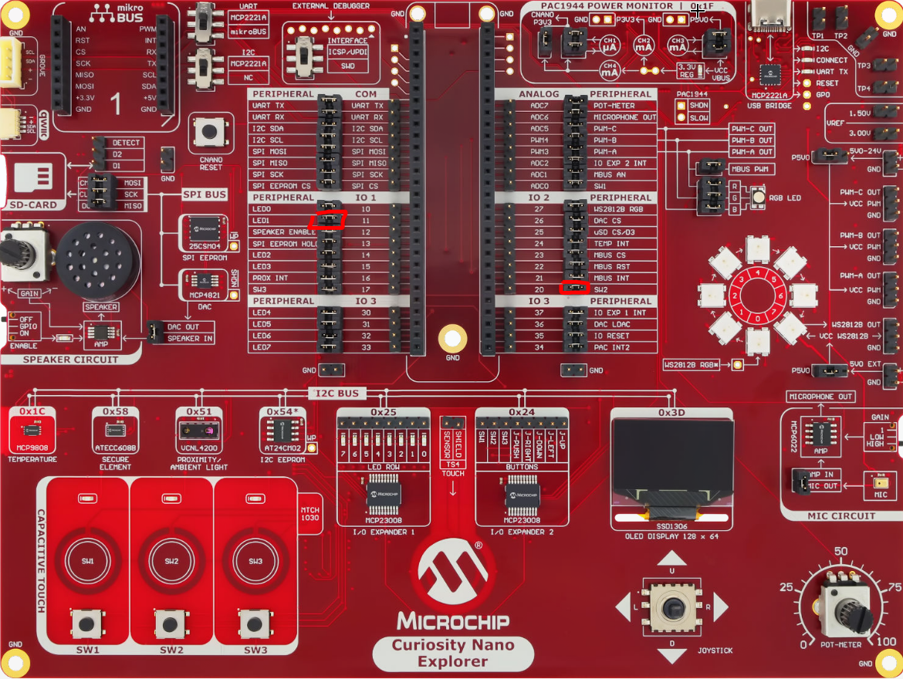
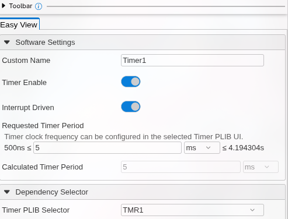
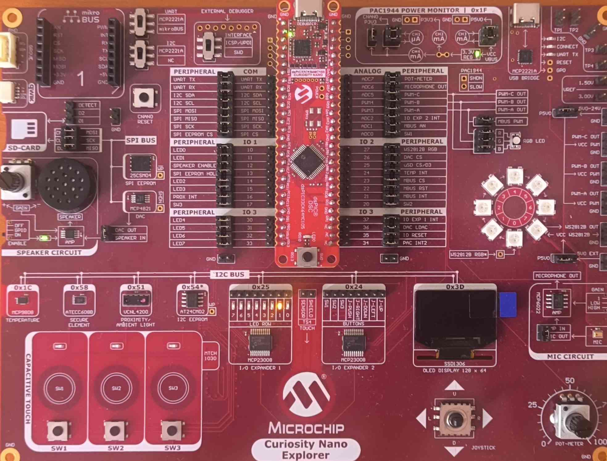

# Timer Project — Non-blocking Timing & Debouncing

In this lab you will use a hardware timer to generate precise, **non-blocking** timing. You will then use that same timer to fix the button-**debouncing** problem left open at the end of the GPIO lab.

## Goals

In this lab you will:

- Blink LED1 **without blocking** the CPU (no more `__delay_ms`)
- Configure a timer to raise an **interrupt** at a fixed rate, and run your code from a **callback**
- Use that fixed-rate sampling to **debounce** SW2 and toggle the LED cleanly — exactly one toggle per press

The tools involved are **LED1** and **SW2**, same as the GPIO lab.

## Physical setup

No new wiring. Keep the same jumpers as in the GPIO lab: **LED1 → IO11** and **SW2 → IO20**.



## Background — why a timer?

In the GPIO lab you used `__delay_ms(500)`. That macro is a **busy wait**: the CPU spins in a loop doing nothing useful for the whole half-second, so it cannot react to anything else during that time.

A hardware timer is a counter that runs **in parallel** with your program. It increments on its own from the system clock and, when it reaches a value you choose (its *period*), it raises a flag — and optionally triggers an **interrupt**. The CPU stays free; it only stops briefly to run a short *callback* when the timer fires, then carries on.

On this board the instruction clock is `FCY = 100 MHz` (`FOSC / 2`). The timer counts at a rate derived from `FCY`, and MCC computes the right reload value for the period you ask for — you do not have to do the register math by hand.

![DIAGRAM: "blocking-vs-timer" — Two horizontal timelines, one above the other, same time axis (0 to ~2 s with 500 ms graduations). TOP, titled "__delay_ms(500)": a CPU activity bar almost entirely filled in red labelled "CPU blocked (busy wait)", interrupted every 500 ms by a tiny green sliver labelled "toggle". BOTTOM, titled "Timer + interrupt": the CPU bar is almost entirely green labelled "CPU free (main loop)", with tiny red ticks every 500 ms labelled "ISR callback (µs)". Below the bottom bar, a sawtooth line representing the timer counter rising to "period" then resetting, with an arrow from each sawtooth peak up to the corresponding ISR tick. Caption: "Same blink, but the CPU is available."](../assets/images/04_timer/debounce_sampling.svg)

## Part 1 — Your mission

### Step 1 — Add and configure the timer

**Task.** In MCC Melody, add a timer (TMR1) that fires every **500 ms** with its **interrupt enabled**, then generate.

1. Which clock source do you select, and why does the requested period of 500 ms not require any manual register calculation?
2. After generating, open `tmr1.h` and list the functions you will need: initialisation, start, and *callback registration*. Write down the exact name of the callback-registration function in **your** generated driver.

### Step 2 — Non-blocking blink

**Task.** Reproduce the 500 ms blink from the GPIO lab **without any `__delay_ms`** in the main loop.

1. Write a short function that toggles LED1, and register it as the timer callback.
2. Start the timer. What does your `while(1)` loop contain now?
3. Explain in one sentence what has fundamentally changed compared with the GPIO version.

### Step 3 — Debounce SW2 with the timer

**Task.** Fix the toggle problem from the GPIO lab: one physical press of SW2 = exactly **one** LED toggle, no matter how long the press or how much the contact bounces.

The strategy: **sample the button at a fixed, slow rate** (change the timer period to **5 ms**) and only act when the level has been **stable for several consecutive samples** — and only on the **transition** from released to pressed.

1. Change the timer period to 5 ms and regenerate.
2. In the callback, implement a small state machine with: the last *stable* state, a stability counter, and a constant `STABLE_SAMPLES` (e.g. 4 samples = 20 ms).
3. Why do you toggle only on the released→pressed **transition**, rather than whenever the stable state is "pressed"? What would happen if you held the button down otherwise?

## Part 2 — Guided correction

### Step 1 — Add and configure the timer

Open the MCC Melody interface (blue MCC icon). In **Device Resources**, add a **Timer (TMR1)**. In its configuration panel set:

- **Clock source**: `FOSC/2` (i.e. `FCY`)
- **Requested Period**: `500 ms` — you will lower this later for debouncing
- Tick **Enable Timer Interrupt**

Then select **Project Resources** on the left and click **Generate**. MCC computes the prescaler and reload value for you from the requested period — that is why no register math is needed.



This generates `tmr1.h` and `tmr1.c`, which expose (among others):

- `TMR1_Initialize()` — applies the configuration (already called by `SYSTEM_Initialize()`)
- `TMR1_Start()` / `TMR1_Stop()` — run / halt the timer
- a **callback registration** function, typically `TMR1_TimeoutCallbackRegister(void (*handler)(void))`

> Check the exact name of the callback function in your generated `tmr1.h` — depending on the driver version it may differ slightly (e.g. `TMR1_TimeoutCallbackRegister` vs `TMR1_OverflowCallbackRegister`). Use the one that is actually declared.

```c
/**
 * @ingroup    timerdriver
 * @brief      This function can be used to override default callback and to define 
 *             custom callback for TMR1 Timeout event.
 * @param[in]  handler - Address of the callback function.  
 * @return     none
 */
void TMR1_TimeoutCallbackRegister(void (*handler)(void));
```

### Step 2 — Non-blocking blink

Register a callback that toggles LED1, and let the timer call it on its own every period. The `while(1)` loop is now empty — and that is the point:

```c
#include "mcc_generated_files/system/system.h"
#include "mcc_generated_files/system/pins.h"

// Called automatically every timer period (here: 500 ms), from the timer interrupt
static void Timer1_Tick(void)
{
    LED1_Toggle();
}

int main(void)
{
    SYSTEM_Initialize();

    TMR1_TimeoutCallbackRegister(&Timer1_Tick);   // check the exact name in tmr1.h
    TMR1_Start();

    while (1)
    {
        // The CPU is free here for other tasks — no blocking delay.
    }
}
```

The LED blinks every 500 ms, but the main loop is completely available. Compare this with the GPIO version where `__delay_ms` froze everything: that difference is the whole point of using a timer.



### Step 3 — Debounce SW2 with the timer

Change the timer **Requested Period** to **5 ms** and regenerate, then use a small state machine in the callback:

```c
#include "mcc_generated_files/system/system.h"
#include "mcc_generated_files/system/pins.h"
#include <stdbool.h>
#include <stdint.h>

#define STABLE_SAMPLES  4      // 4 x 5 ms = 20 ms of a stable level required

// Called every 5 ms
static void Timer1_Tick(void)
{
    static uint8_t counter     = 0;
    static bool    stableState = true;          // true = released (weak pull-up keeps it HIGH)

    bool reading = (SW2_GetValue() != 0);       // true = released, false = pressed (active low)

    if (reading != stableState)
    {
        counter++;
        if (counter >= STABLE_SAMPLES)          // the new level has held long enough
        {
            stableState = reading;
            counter      = 0;

            if (stableState == false)           // newly, stably PRESSED -> act once
            {
                LED1_Toggle();
            }
        }
    }
    else
    {
        counter = 0;                            // bounce/noise: reset the stability counter
    }
}

int main(void)
{
    SYSTEM_Initialize();

    TMR1_TimeoutCallbackRegister(&Timer1_Tick);
    TMR1_Start();

    while (1)
    {
        // free
    }
}
```

Toggling only on the released→pressed **transition** is what guarantees *one action per press*: the state machine changes `stableState` once when the press is confirmed, and cannot fire again until the button has been stably released. If you toggled whenever the stable state was "pressed", holding the button would toggle the LED every 20 ms — the flicker would be back, just slower.

Now one physical press = exactly **one** toggle, no matter how the contact bounces or how long you hold the button. Try holding it down: the LED no longer flickers.

![DIAGRAM: "debounce-sampling" — Chronogram. Top line: the raw SW2 signal, idle HIGH, then a falling edge with 3–4 rapid bounces (narrow spikes), then stable LOW for a while, then a rising edge with bounces, back to HIGH. Below the signal: regularly spaced sample arrows every 5 ms pointing up at the signal. Under each arrow, the sampled value (1 or 0). Below that, the stability counter value at each sample (0,1,2,3,4…), resetting to 0 whenever the reading flips during the bounces. A star/marker labelled "stableState ← pressed, TOGGLE" at the first sample where the counter reaches 4. During the bounce zone, annotate "bounces rejected: counter reset". Caption: "Fixed-rate sampling + stability count = one clean event per press."](../assets/images/04_timer/blocking_vs_timer.svg)


## What you learned

- A hardware timer gives **deterministic, parallel** timing without blocking the CPU.
- **Interrupts + callbacks** let the MCU react on a fixed schedule instead of polling in a tight loop.
- **Fixed-rate sampling with a stability count** is the standard, reliable way to debounce a mechanical input.
- Acting on the **transition** of the stable state (not the state itself) gives exactly one event per press.

## Next

**ADC** — reading an analog voltage (the on-board potentiometer) and displaying it live on the OLED screen.

> *Deferred:* **PWM** — generating an analog-like level (LED brightness) from a digital pin — is postponed until it can be validated visually or with the oscilloscope.
