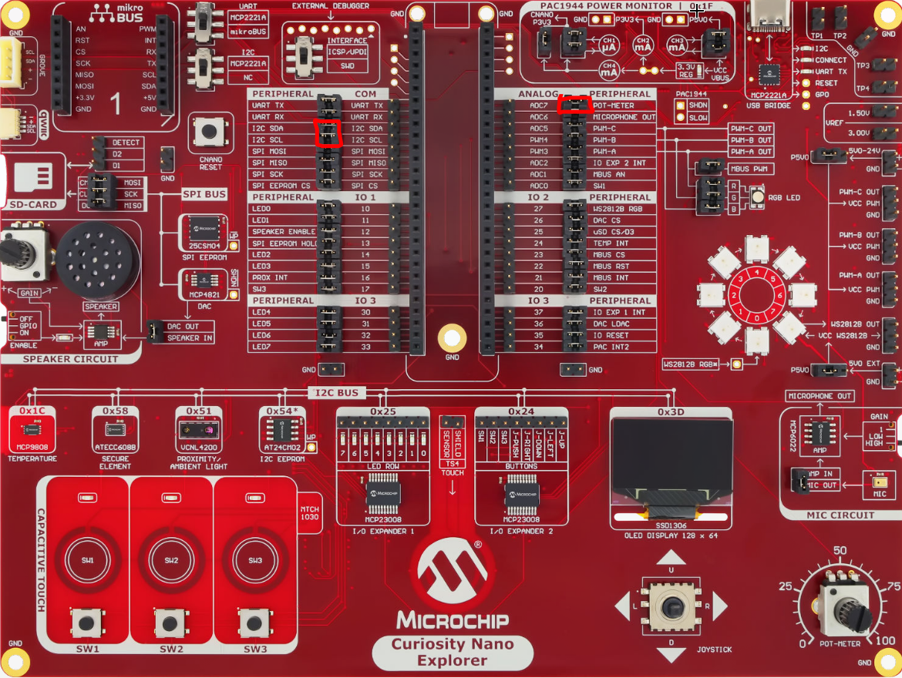

# ADC Project — Reading the Potentiometer, Displaying on the OLED

In this lab you will read the on-board rotary potentiometer with the dsPIC's analog-to-digital converter (ADC), and display the live value on the SSD1306 OLED screen over I2C.

## Goals

In this lab you will:

- Configure the ADC to read an analog voltage from the **potentiometer**
- Convert that reading into a digital value (0–4095)
- Drive the **OLED display** over I2C and show the value, updated in real time

The tools involved are the **POT-METER** (rotary potentiometer), the **OLED display** (SSD1306), and **LED1** as a simple heartbeat.

## Physical setup


*Figure — Pin mapping of the dsPIC33CK64MC105 on the Curiosity Nano Explorer board. The potentiometer's wiper is exposed as **POT-METER** and maps to the **ADC7** position, which is physical pin **RA0 / AN0**. Place a jumper linking **POT-METER** to **ADC7**.*

The OLED is permanently wired to the board's I2C bus, but that bus only reaches the microcontroller through the two **I2C SDA** and **I2C SCL** jumpers in the COM remapping area. Make sure **both** are in place — if either is missing, the screen (and every other I2C device on the board) will never answer.



## Background — what is an ADC?

The microcontroller is digital: it only understands 0s and 1s. The potentiometer, on the other hand, outputs a **continuous voltage** between 0 V and 3.3 V depending on its position. An **Analog-to-Digital Converter** bridges the two worlds: it samples that voltage and returns a number proportional to it.

This dsPIC's ADC is **12-bit**, so it splits the 0–3.3 V range into `2^12 = 4096` steps. A reading of `0` means ~0 V (potentiometer fully one way), `4095` means ~3.3 V (fully the other way), and `2048` is roughly the middle. Each step therefore represents about `3.3 V / 4096 ≈ 0.8 mV`.


![DIAGRAM: "adc-signal-chain" — Horizontal block chain, left to right: [Potentiometer (0–3.3 V)] → jumper symbol labelled "POT-METER → ADC7" → [Pin RA0 / AN0] → [ADC 12-bit] → value "0..4095" → [sprintf "POT: %4u"] → [I2C1 @100 kHz, RC8/RC9] → [OLED SSD1306 @0x3D]. Analog part of the chain in one colour, digital part in another, with a vertical dashed line "analog | digital" through the ADC block. Caption: "The full path from knob to pixels."](../assets/images/adc-signal-chain.png)

## Part 1 — Your mission

### Step 1 — Configure the ADC pin and module

**Task.** In MCC Melody:

1. Configure pin **RA0** as an **analog input** named `POT`.
2. Add the **ADC** module, enable channel **AN0** with the custom name `POT`.
3. One channel setting is easy to miss and, if forgotten, *no conversion will ever happen* even though everything compiles: find it in the channel table and set it correctly. (Hint: how does the ADC know **when** to start converting, if you trigger it from software?)
4. Generate, then open `adc1.h` and list the three functions you will need to power up the ADC, start a conversion, and fetch a result.

### Step 2 — Read the potentiometer

**Task.** In `main.c`, write a loop that continuously reads the potentiometer into a variable.

1. A conversion is not instantaneous: how do you make sure the result is ready before reading it? Give two possible approaches, and pick the simpler one for now.
2. Run it under the debugger and watch the variable while turning the knob. What range of values do you observe?

### Step 3 — Port the OLED driver

**Task.** To display the value, reuse Microchip's SSD1306 example driver (`ssd1306.c`, `ssd1306.h`, `font.h`) and port it to this project. Add the **I2C1 (Host, 100 kHz)** module in MCC, then integrate the three files.

Porting raises four classic problems — solve each:

1. **Link error `multiple definition of ASCII/MCHP`** when the project builds. What C rule is being violated by `font.h`, and how do you fix it?
2. **I2C address**: the driver defaults to one of the two possible SSD1306 addresses. Which one does *this* board use, and how can you find out?
3. The driver uses `__delay_ms` / `__delay_us`. What must be defined, and where, for these to compile?
4. The SSD1306 has a RESET pin. Look at the board schematic: which microcontroller pin must drive it?

### Step 4 — The non-blocking I2C trap

**Task.** With the driver compiled and `SSD1306_Init()` called, the screen may well stay **black** — while everything compiles and runs without error.

1. Read the description of `I2C1_Write()` in the generated `i2c1.h`. What does its return value actually mean? When does the function return?
2. The original driver waits `__delay_us(100)` after each write. A 2-byte transfer at 100 kHz takes how long? (Count the bits on the bus, including address and ACKs.)
3. Deduce what happens to the ~25 commands of `SSD1306_Init()`, and fix `SSD1306_SendCommand` / `SSD1306_SendData` so that no byte is ever dropped — without any blind delay.

### Step 5 — Putting it together

**Task.** Combine everything: read the potentiometer, format the value, display it on the OLED, and blink LED1 as a heartbeat, refreshing ~10 times per second.

1. When the displayed number goes from `4095` to `800`, stale digits from the previous value can remain on screen. Find a formatting trick that avoids it.
2. Verify: turning the knob sweeps the display between ~0 and ~4095, and LED1 blinks steadily.

## Part 2 — Guided correction

### Step 1 — Configure the ADC pin and module

Open the MCC Melody interface (blue MCC icon).

First, in the **pin table**, set **RA0** as an **analog input** and tick its *analog* box, then rename it `POT`.

Next, in **Device Resources**, add the **ADC** module. In its configuration, find the channel table, enable the **AN0** channel, give it the custom name `POT`, and — this is the step that is easy to miss — set its **Trigger Source** to **Common Software Trigger**. Without a trigger source, the software trigger fires but no channel is subscribed to it, so no conversion ever happens.


*Figure — ADC channel table: AN0 enabled, named POT, Trigger Source set to Common Software Trigger.*

Select **Project Resources** on the left and click **Generate**. This produces `adc1.h` / `adc1.c`, which expose (among others):

- `ADC1_Enable()` — powers up the ADC core
- `ADC1_SoftwareTriggerEnable()` — starts a conversion on the common software trigger
- `ADC1_ConversionResultGet(POT)` — returns the latest 12-bit result for the POT channel

### Step 2 — Read the potentiometer

A minimal read loop: trigger a conversion, give it a brief moment to complete, then read the result.

```c
#include "mcc_generated_files/system/system.h"
#include "mcc_generated_files/system/pins.h"
#include "mcc_generated_files/adc/adc1.h"

#define FCY 100000000UL
#include <libpic30.h>

uint16_t adcValue;

int main(void)
{
    SYSTEM_Initialize();
    ADC1_Enable();

    while (1)
    {
        ADC1_SoftwareTriggerEnable();      // start a conversion
        __delay_us(50);                    // let it finish
        adcValue = ADC1_ConversionResultGet(POT);   // 0 .. 4095
    }
}
```

> A cleaner alternative is to poll a "conversion complete" status instead of using a fixed delay (e.g. `while (!ADC1_IsConversionComplete(POT)) { }`). Check the exact function name and behaviour in your generated `adc1.h` before relying on it. The fixed `__delay_us` above is simpler and perfectly fine at this stage.

At this point `adcValue` holds a live reading between 0 and 4095, but you have no way to *see* it outside the debugger. That is what the OLED is for.

### Step 3 — Port the OLED driver

**Copy the three files into the project folder** (next to `main.c`) and add them via *Add Existing Item…* — do not leave them outside the project, or the include paths break. Then answer by answer:

1. **One definition rule.** `font.h` ships with the `ASCII` and `MCHP` arrays *defined* in the header. A header is included by several `.c` files, so the arrays get defined once per inclusion — a *multiple definition* link error. Move the array **definitions** into `ssd1306.c`, and leave only `extern` **declarations** in `font.h`:
   ```c
   extern const unsigned char ASCII[][5];
   extern const unsigned char MCHP[1024];
   ```

2. **I2C address.** On this board the OLED answers at **`0x3D`** (the alternative `0x3C` only applies if pin A0 is tied to GND, which it is not here — the schematic tells you). Set:
   ```c
   #define SSD1306_I2C_ADDRESS 0x3D
   ```

3. **Delays.** `__delay_ms` / `__delay_us` require `FCY` to be defined **before** `#include <libpic30.h>`. Add `#define FCY 100000000UL` at the top.

4. **Reset line.** Trick question: the SSD1306 RESET pin is handled automatically by an on-board RC network, so there is **no** microcontroller pin to drive — you can ignore reset entirely in software.

Add the **I2C (I2C1, Host)** module in MCC, set it to **100 kHz**, generate, and make sure `ssd1306.c` includes the generated driver header:

```c
#include "mcc_generated_files/i2c_host/i2c1.h"
```

`[CAPTURE: MCC I2C1 configuration window — Host mode, 100 kHz, on RC8/RC9]`

### Step 4 — The non-blocking I2C trap

This is the subtle part, and the one most likely to leave you with a **blank screen even though everything compiles**.

The MCC `I2C1_Write()` function is **non-blocking and interrupt-driven**: it *starts* a transfer and returns immediately. Its `true`/`false` return only means "request accepted", not "transfer finished". The original driver simply waits a fixed `__delay_us(100)` after each write — but a 2-byte transfer at 100 kHz takes about **280 µs** (start + address + 2 data bytes + ACKs), far more than 100 µs. So the next command is fired while the previous one is still on the bus, `I2C1_Write()` sees the bus busy, returns `false`, and **the byte is silently dropped**. Across the ~25 commands of `SSD1306_Init()`, almost all are lost, the display is never initialised, and it stays black — without ever blocking.

The fix is to wait for the **real** end of each transfer using `I2C1_IsBusy()` instead of a blind delay. In `ssd1306.c`:

```c
// Send an I2C command byte
void SSD1306_SendCommand(uint8_t command) {
    uint8_t cmd[] = {SSD1306_COMMAND, command};
    while (I2C1_IsBusy()) { }                        // bus free?
    I2C1_Write(SSD1306_I2C_ADDRESS, cmd, sizeof(cmd));
    while (I2C1_IsBusy()) { }                        // wait for completion
}

// Send an I2C data byte
void SSD1306_SendData(uint8_t data) {
    uint8_t d[] = {SSD1306_DATA_CONTINUE, data};
    while (I2C1_IsBusy()) { }
    I2C1_Write(SSD1306_I2C_ADDRESS, d, sizeof(d));
    while (I2C1_IsBusy()) { }
}
```

`I2C1_IsBusy()` waits exactly as long as the transfer needs — no more, no less — so no byte is ever dropped.

![DIAGRAM: "i2c-nonblocking-trap" — Two timelines. TOP, "Original driver (broken)": a bus-activity bar showing "transfer #1 (≈280 µs)" as a long block; above it, an arrow "I2C1_Write #2" fired at t = 100 µs (after the blind delay), landing INSIDE transfer #1, with a red cross and the label "bus busy → returns false → byte dropped". BOTTOM, "Fixed with IsBusy()": transfer #1 block, then a short hatched zone labelled "while(I2C1_IsBusy())", then "I2C1_Write #2" starting exactly at the end, green check mark. Caption: "A blind 100 µs delay is shorter than the 280 µs transfer — wait on the hardware, not on a guess."](../assets/images/i2c_nonblocking_trap.svg)

### Step 5 — Putting it together

```c
#include "mcc_generated_files/system/system.h"
#include "mcc_generated_files/system/pins.h"
#include "mcc_generated_files/adc/adc1.h"
#include "ssd1306.h"
#include <stdio.h>

#define FCY 100000000UL
#include <libpic30.h>

uint16_t adcValue;
char buffer[16];

int main(void)
{
    SYSTEM_Initialize();
    ADC1_Enable();
    SSD1306_Init();
    SSD1306_Clear();

    while (1)
    {
        ADC1_SoftwareTriggerEnable();
        __delay_us(50);
        adcValue = ADC1_ConversionResultGet(POT);

        // %4u + trailing spaces: pads the number and erases the previous digits
        sprintf(buffer, "POT: %4u   ", adcValue);
        SSD1306_SelectPage(0);
        SSD1306_WriteString(buffer);

        LED1_Toggle();          // heartbeat: confirms the loop is running
        __delay_ms(100);
    }
}
```

The formatting trick is `%4u` plus trailing spaces: the field is always the same width, so shorter numbers overwrite all the digits of longer ones.

Turn the potentiometer: the number on the OLED should sweep between roughly `0` and `4095`, and LED1 should blink steadily.

`[CAPTURE: OLED showing "POT: nnnn", with the potentiometer at a mid position]`
`[CAPTURE: two photos side by side — potentiometer turned fully one way (~0) and fully the other (~4095) — to show the value tracking]`

## What you learned

- An **ADC** turns a continuous voltage into a discrete number; this 12-bit ADC gives 0–4095 over 0–3.3 V.
- A software-triggered ADC channel needs an explicit **Trigger Source** (Common Software Trigger), or it never converts.
- MCC's `I2C1_Write()` is **non-blocking** — you must wait on `I2C1_IsBusy()` between transfers, otherwise commands are dropped and the display stays blank.
- Reusing a third-party driver means respecting C basics: **definitions in a `.c`, `extern` declarations in the `.h`**, and the files physically inside the project.

## Next

**I2C sensor** — the OLED was an I2C *output*; next you will read a real I2C *input*: the VCNL4200 proximity sensor.

> *Deferred:* **ADC + PWM** — reusing this ADC reading to drive a PWM duty cycle (LED brightness) — closing the loop between an analog input and an analog-like output.
