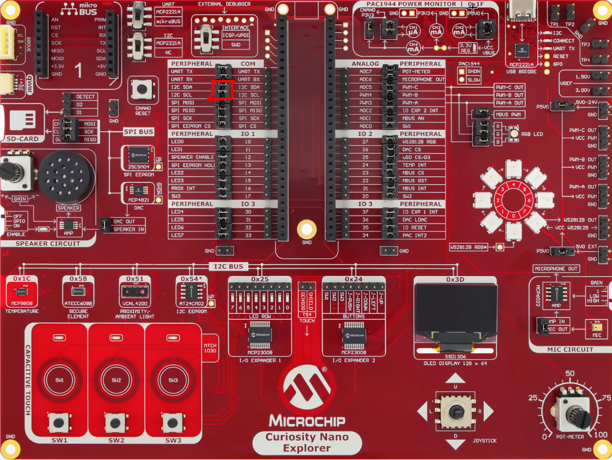

# Proximity Sensor Project — Reading a Real I2C Device

In this lab you will read the on-board **VCNL4200** infrared proximity sensor over I2C and show the live distance value on the OLED screen.

This is the **first stage of a larger application**: later labs will reuse this same reading to drive a colour LED (so the colour follows your hand) and to stream the value to a PC over the serial port. Here we focus on getting the sensor to talk.

## Goals

In this lab you will:

- Configure and read a real external **I2C sensor** (the VCNL4200)
- Understand why a register read needs a **repeated start** (`I2C1_WriteRead`)
- Reuse the OLED to display the live **proximity** value

The tools involved are the **VCNL4200 proximity sensor**, the **OLED display**, and **LED1** as a heartbeat.

## Physical setup

The VCNL4200 and the OLED both sit on the **same I2C bus**, at different addresses (`0x51` for the sensor, `0x3D` for the screen), so there is nothing new to wire. As in the ADC lab, only the two **I2C SDA** and **I2C SCL** jumpers in the COM remapping area need to be in place.



## Background — how a proximity sensor works

The VCNL4200 has an infrared emitter and a light detector. It sends out IR pulses and measures how much light bounces back: the closer an object is, the more light is reflected, so the reported value **rises as something approaches** and falls back to a baseline when nothing is near. It is not an absolute distance in centimetres — it is a relative reflectance value (here 12-bit, 0–4095).


Communication is over I2C, but with one twist compared to the OLED: the sensor's registers are **16-bit words**, each addressed by a one-byte **command code**, and the data comes back **least-significant byte first**.

## Part 1 — Your mission

### Step 1 — Reuse the existing setup

**Task.** Decide what MCC configuration this lab needs. Do you need the ADC module? A new I2C module? Justify.

### Step 2 — The VCNL4200 register map

**Task.** Open the VCNL4200 datasheet. Identify the command codes of the three registers you will need:

1. the proximity **configuration** register (to power the function on),
2. the proximity **data** register,
3. the **device ID** register — and note the ID value the sensor must return.

### Step 3 — Wake the sensor up

**Task.** Out of reset, the proximity function is **shut down**. Find the bit responsible in the configuration register, and write a `VCNL4200_Init()` function that clears it.

*Hint:* the configuration register is a 16-bit pair (PS_CONF1 low byte, PS_CONF2 high byte) written in **one** I2C transaction of three bytes: command code, low byte, high byte. Remember the `I2C1_IsBusy()` lesson from the OLED lab.

### Step 4 — Read a register (the repeated-start question)

**Task.** Write `VCNL4200_ReadReg(uint8_t reg)` returning the 16-bit register value.

1. Reading a register is a two-phase operation: first tell the sensor *which* register, then read the data. Try the naive approach first — an `I2C1_Write()` of the command code followed by a separate `I2C1_Read()` of two bytes. What do you get?
2. Look at the I2C functions available in `i2c1.h`. One of them performs both phases in a **single transaction**. Which one, and what does it insert between the write phase and the read phase that the naive version does not?
3. The data comes back LSB first — reassemble the 16-bit word accordingly.

### Step 5 — Validate before trusting the data

**Task.** Before reading proximity values, prove the link works: read the **ID register** and check its value. Why is this check worth doing *first*, and what does it discriminate between?

### Step 6 — Putting it together

**Task.** On power-up, show the device ID on the OLED for two seconds, then loop: read the proximity register ~10 times per second and display it, with LED1 as heartbeat. Verify that moving your hand toward the sensor makes the value climb.

## Part 2 — Guided correction

### Step 1 — Reuse the existing setup

No new MCC module is needed. You already have **I2C1 (Host, 100 kHz)** and the ported OLED driver from the ADC lab — keep them. You do **not** need the ADC module here: the sensor is digital (I2C), not analog. The 12-bit value arrives already converted, over the bus.

### Step 2 — The VCNL4200 register map

We only need three registers, each identified by its command code:

| Command code | Register | Use |
|---|---|---|
| `0x03` | PS_CONF1 / PS_CONF2 | configuration (power on, integration time…) |
| `0x08` | PS_DATA | the proximity reading (16-bit, LSB first) |
| `0x0E` | ID | device ID — low byte is `0x58`, used to check the sensor is alive |

### Step 3 — Wake the sensor up

The shutdown bit is **`PS_SD`**, bit 0 of PS_CONF1. Clearing it enables the proximity function. We send three bytes in one transaction: the command code, then the low byte (PS_CONF1), then the high byte (PS_CONF2).

```c
#define VCNL4200_ADDR     0x51
#define VCNL4200_PS_CONF  0x03   // command code: PS_CONF1 (low) + PS_CONF2 (high)
#define VCNL4200_PS_DATA  0x08   // command code: proximity output (16-bit, LSB first)
#define VCNL4200_ID       0x0E   // command code: device ID (low byte expected = 0x58)

static void VCNL4200_Init(void)
{
    // PS_CONF1 (low)  = 0x08 : proximity enabled (PS_SD = 0), medium integration time
    // PS_CONF2 (high) = 0x00 : 12-bit output, no interrupt (we poll)
    uint8_t cfg[3] = { VCNL4200_PS_CONF, 0x08, 0x00 };
    while (I2C1_IsBusy()) { }
    I2C1_Write(VCNL4200_ADDR, cfg, sizeof(cfg));
    while (I2C1_IsBusy()) { }
}
```

> The `0x08` configuration byte (integration time, duty) is a reasonable starting point. If your readings are too weak or too noisy, these are the tuning knobs to adjust — see the VCNL4200 datasheet.

### Step 4 — Read a register: the repeated-start trap

This is the key new idea of this lab. With the naive approach — `I2C1_Write()` of the command code, then a separate `I2C1_Read()` — you get **only zeros**. `I2C1_Write()` ends its transaction with a **Stop** condition, and on a Stop the sensor forgets which register was requested.

The read must begin with a **repeated start**: the bus is never released between the write phase and the read phase. The MCC driver has exactly the right function: `I2C1_WriteRead()`, which writes the command code, inserts the repeated start, then reads — all in one transaction.

![DIAGRAM: "i2c-repeated-start" — Two I2C frame timelines drawn as sequences of labelled segments. TOP, "Naive (returns zeros)", crossed out in red: [START][ADDR 0x51 + W][cmd 0x08][STOP]   …bus released…   [START][ADDR 0x51 + R][data??][data??][STOP], with a red annotation under the STOP in the middle: "Stop → sensor forgets the requested register". BOTTOM, "WriteRead (correct)", green: [START][ADDR 0x51 + W][cmd 0x08][**REPEATED START** highlighted][ADDR 0x51 + R][data LSB][data MSB][STOP]. Annotate the two data bytes: "LSB first". Caption: "One transaction, no Stop in the middle: that is what I2C1_WriteRead() does."](../assets/images/i2c_repeated_start.svg)

```c
// Read a 16-bit register via WriteRead (repeated start is mandatory)
static uint16_t VCNL4200_ReadReg(uint8_t reg)
{
    uint8_t rx[2] = {0, 0};
    while (I2C1_IsBusy()) { }
    I2C1_WriteRead(VCNL4200_ADDR, &reg, 1, rx, 2);
    while (I2C1_IsBusy()) { }
    return (uint16_t)(rx[0] | (rx[1] << 8));   // LSB first
}
```

### Step 5 — Validate before trusting the data

Read the **ID register** (`0x0E`) first: it must return `0x58` in its low byte (`0x1058` as a full word). If you get that, the I2C link and the `WriteRead` are working; if not, fix the link first instead of chasing the proximity value. The check discriminates a **wiring/protocol problem** (wrong ID or zeros) from a **sensor-tuning problem** (correct ID but weak readings) — the same idea as pinging a device before using it.

### Step 6 — Putting it together

```c
#include "mcc_generated_files/system/system.h"
#include "mcc_generated_files/system/pins.h"
#include "mcc_generated_files/i2c_host/i2c1.h"
#include "ssd1306.h"
#include <stdio.h>

#define FCY 100000000UL
#include <libpic30.h>

#define VCNL4200_ADDR     0x51
#define VCNL4200_PS_CONF  0x03
#define VCNL4200_PS_DATA  0x08
#define VCNL4200_ID       0x0E

static void VCNL4200_Init(void)
{
    uint8_t cfg[3] = { VCNL4200_PS_CONF, 0x08, 0x00 };
    while (I2C1_IsBusy()) { }
    I2C1_Write(VCNL4200_ADDR, cfg, sizeof(cfg));
    while (I2C1_IsBusy()) { }
}

static uint16_t VCNL4200_ReadReg(uint8_t reg)
{
    uint8_t rx[2] = {0, 0};
    while (I2C1_IsBusy()) { }
    I2C1_WriteRead(VCNL4200_ADDR, &reg, 1, rx, 2);
    while (I2C1_IsBusy()) { }
    return (uint16_t)(rx[0] | (rx[1] << 8));
}

uint16_t prox;
char buffer[16];

int main(void)
{
    SYSTEM_Initialize();
    SSD1306_Init();
    SSD1306_Clear();
    VCNL4200_Init();

    // Sanity check: the ID must read 0x1058 (low byte 0x58)
    uint16_t id = VCNL4200_ReadReg(VCNL4200_ID);
    sprintf(buffer, "ID: %04X   ", id);
    SSD1306_SelectPage(0);
    SSD1306_WriteString(buffer);
    __delay_ms(2000);                 // hold the ID on screen for 2 s

    while (1)
    {
        prox = VCNL4200_ReadReg(VCNL4200_PS_DATA);
        sprintf(buffer, "PROX:%5u   ", prox);
        SSD1306_SelectPage(0);
        SSD1306_WriteString(buffer);

        LED1_Toggle();                // heartbeat
        __delay_ms(100);
    }
}
```

On power-up the screen briefly shows the device ID, then switches to the live proximity value: move your hand towards the sensor and the number climbs; pull away and it drops back.

`[CAPTURE: OLED showing "ID: 1058" at startup]`
`[CAPTURE: two photos side by side — hand far from the sensor (low value) and hand close (high value) — showing PROX tracking]`

## What you learned

- Driving an **external I2C sensor** means two steps: **configure** its registers, then **read** them.
- This sensor's registers are **16-bit, command-code addressed, LSB first**.
- A register read requires a **repeated start** — use `I2C1_WriteRead()`, never a separate Write then Read.
- Always **check the device ID first**: it isolates a wiring/protocol problem from a sensor-tuning problem.

## Next

This reading will now feed two outputs:

- **Serial output (UART)** — send the proximity value to the PC over the debugger's virtual COM port (CDC), to read it in a terminal or plot it live in the Data Visualizer.
- *Deferred:* **Colour LED (PWM)** — drive the on-board RGB LED with three PWM channels so its colour follows the proximity value.
